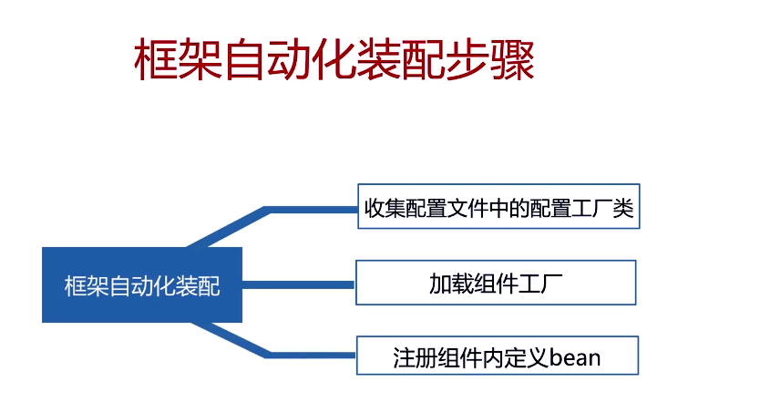
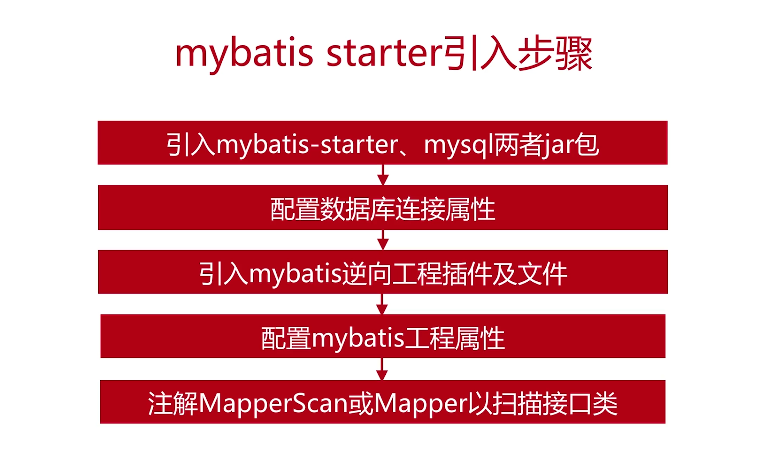

[TOC]


> 本文源码分析基于 SpringBoot 2.1.7.RELEASE


 


## 1.2 SpringBoot 启动流程


```java
SpringApplication.run(Sb2Application.class, args);
```


下面两步的代码如下所示，其中`primarySources`是`@SpringBootApplication`标注的主类

```java
// SpringApplication.java
public static ConfigurableApplicationContext run(Class<?>[] primarySources, String[] args) {
    return new SpringApplication(primarySources).run(args);
}
```


***************

**SpringBoot 启动流程**

1. 框架初始化，即创建`SpringApplication` 对象
2. 框架启动，即执行`SpringApplication#run(primarySources, args)`方法
3. 自动化装配，


## 1.3 框架初始化


```java
// SpringApplication.java
public SpringApplication(ResourceLoader resourceLoader, Class<?>... primarySources) {
    // 1. 配置资源加载器 resourceLoader
    this.resourceLoader = resourceLoader;
    Assert.notNull(primarySources, "PrimarySources must not be null");
    // 2. 配置主类 primarySources
    this.primarySources = new LinkedHashSet<>(Arrays.asList(primarySources));
    // 3. 应用环境监测, NONE, SERVLET, REACTIVE 如果是Web环境咋返回SERVLET
    this.webApplicationType = WebApplicationType.deduceFromClasspath();
    this.bootstrappers = new ArrayList<>(getSpringFactoriesInstances(Bootstrapper.class));
    // 4. 配置系统初始化器, 见2.1章节
    setInitializers((Collection) getSpringFactoriesInstances(ApplicationContextInitializer.class));
    // 5. 配置应用监听器, 见3.3章节
    setListeners((Collection) getSpringFactoriesInstances(ApplicationListener.class));
	// 6. 配置主类, 即调用main方法的类
    this.mainApplicationClass = deduceMainApplicationClass();
}
```

## 1.4 框架启动


```java
public ConfigurableApplicationContext run(String... args) {
    StopWatch stopWatch = new StopWatch();
    // 1. 计时器开始计时, 见6.1章节
    stopWatch.start();
    ConfigurableApplicationContext context = null;
    Collection<SpringBootExceptionReporter> exceptionReporters = new ArrayList<>();
    // 2. HeadLess 模式赋值
    configureHeadlessProperty();
    SpringApplicationRunListeners listeners = getRunListeners(args);
    // 3. 发送StaringEvent
    listeners.starting();
    try {
        ApplicationArguments applicationArguments = new DefaultApplicationArguments(args);
        // 4. 配置环境模块, 见7.3章节
        ConfigurableEnvironment environment = prepareEnvironment(listeners, applicationArguments);
        configureIgnoreBeanInfo(environment);
        // 打印 banner, 见5.2章节
        Banner printedBanner = printBanner(environment);
        // 创建应用上下文对象 ApplicationContext
        context = createApplicationContext();
        // 配置异常上报器, 见8.1章节
        exceptionReporters = getSpringFactoriesInstances(SpringBootExceptionReporter.class,
                                                         new Class[] { ConfigurableApplicationContext.class }, context);
        // 准备上下文(重点) 见2.2章节,调用系统初始化器进行一些初始化操作,如注册属性
        prepareContext(context, environment, listeners, applicationArguments, printedBanner);
        // 刷新上下文(重点)
        refreshContext(context);
        afterRefresh(context, applicationArguments);
        // 计时器停止计时
        stopWatch.stop();
        if (this.logStartupInfo) {
            new StartupInfoLogger(this.mainApplicationClass).logStarted(getApplicationLog(), stopWatch);
        }
        // 发送startedEvent事件
        listeners.started(context);
        // 回调runners, 见6.3章节
        callRunners(context, applicationArguments);
    }
    catch (Throwable ex) {
        handleRunFailure(context, ex, exceptionReporters, listeners);
        throw new IllegalStateException(ex);
    }

    try {
        listeners.running(context);
    }
    catch (Throwable ex) {
        handleRunFailure(context, ex, exceptionReporters, null);
        throw new IllegalStateException(ex);
    }
    return context;
}
```


## 1.5 自动化装配




# 2. 系统初始化器

在SpringBoot启动流程第一步**框架初始化**过程中，很重要的一步就是**配置系统初始化器**。

系统初始化器 `ApplicationContextInitializer`，是 Spring容器刷新`refresh`之前执行的一个回调函数，作用是向 SpringBoot 容器中**注册属性**，可以继承该接口实现自定义初始化器。


## 2.1 自定义系统初始化器

向Spring应用中注册自定义系统初始化器一共有 3 种方式：


- **方式1**
  - 实现`ApplicationContextInitializer`接口，重写`initialize()`方法
  - `spring.factories`内填写`ApplicationContextInitializer`接口实现的实现类，即系统初始化器

```java
@Slf4j
@Order(1)
public class FirstInitializer implements ApplicationContextInitializer<ConfigurableApplicationContext> {
    // 初始化方法, 所有系统初始化器都是调用该方法注册属性
    @Override
    public void initialize(ConfigurableApplicationContext configurableApplicationContext) {
        ConfigurableEnvironment environment = configurableApplicationContext.getEnvironment();

        // 1. 自定义配置
        Map<String, Object> map = new HashMap<>();
        map.put("key1", "value1");
        MapPropertySource mapPropertySource = new MapPropertySource("firstInitializer", map);

        // 2. 向SpringBoot 容器中注册属性, 即将自定义配置属性加入环境变量
        environment.getPropertySources().addLast(mapPropertySource);

        log.info("================ run firstInitializer...=============");
    }
}
```

`spring.factories` 内填写系统初始化器的`ApplicationContextInitializer`实现类为`FirstInitializer`

```properties
# resources/META_INF/spring.factories

org.springframework.context.ApplicationContextInitializer=com.mooc.sb2.initializer.FirstInitializer
```


- **方式2**
  - 实现`ApplicationContextInitializer`接口，重写`initialize()`方法
  - SpringApplication 类初始化后，使用`SpringApplication#addInitializers()`手动添加该初始化器

```java
public class Sb2Application {

    public static void main(String[] args) {
        // SpringApplication.run(Sb2Application.class, args);

        // 自定义Spring应用启动
        SpringApplication springApplication = new SpringApplication(Sb2Application.class);
        // 添加初始化器
        springApplication.addInitializers(new SecondInitializer());
        // 启动spring容器
        springApplication.run(args);
    }
}
```


- **方式3**
  - 实现`ApplicationContextInitializer`接口，重写`initialize()`方法
  - `application.properties`内填写接口实现，通过`DelegatingApplicationContextInitializer`代理执行

```properties
# application.properties

# 注册自定义初始化器
context.initializer.classes=com.mooc.sb2.initializer.ThirdInitializer
```


## 2.2 加载初始化器


我们自定义了系统初始化器，SpringBoot 容器通过`SpringFactoriesLoader`获取系统初始化器。

**`SpringFactoriesLoader`介绍**

1. 框架内部使用的通用工厂加载机制，用人话说就是加载`spring.factories`中配置的类
2. 从classpath下多个jar包特定的位置读取文件并初始化类
3. 文件内容必须是KV形式，即properties类型
4. key是接口的全限定名，value是实现类的全类名，多个实现类用逗号分隔


**框架初始化**的第 4 步是配置系统初始化器，即在初始化 SpringApplication `new SpringApplication()`时获取所有的`ApplicationContextInitializer`实例，并设置到 `SpringApplication.initializers`属性中。

```java
// SpringApplication.java的构造方法, 在初始化时设置系统初始化器

public SpringApplication(ResourceLoader resourceLoader, Class<?>... primarySources) {
    this.resourceLoader = resourceLoader;
    Assert.notNull(primarySources, "PrimarySources must not be null");
    this.primarySources = new LinkedHashSet<>(Arrays.asList(primarySources));
    this.webApplicationType = WebApplicationType.deduceFromClasspath();
    
    // 配置系统初始化器， 获取ApplicationContextInitializer接口的所有实现类
    // 详细代码见下个代码块1
    setInitializers((Collection) getSpringFactoriesInstances(ApplicationContextInitializer.class));
    
    // 配置监听器, 获取ApplicationListener接口的所有实现类
    // 也是通过SpringFactoriesLoader加载spring.factories中配置的类
    // 见3.2章节
    setListeners((Collection) getSpringFactoriesInstances(ApplicationListener.class));
    this.mainApplicationClass = deduceMainApplicationClass();
}
```

通过上面代码可以看出，配置系统初始化器可以分为两个步骤：

1. 获取所有ApplicationContextInitializer接口的实现类，即系统初始化器 

```java
SpringApplication.java

// 通过接口type=ApplicationContextInitializer获取其所有实现类
private <T> Collection<T> getSpringFactoriesInstances(Class<T> type, Class<?>[] parameterTypes, Object... args) {
    // 获取类加载器
    ClassLoader classLoader = getClassLoader();
    
    // 获取所有ApplicationContextInitializer实现类的类名
    // 详细见代码块1.1
    Set<String> names = new LinkedHashSet<>(SpringFactoriesLoader.loadFactoryNames(type, classLoader));

    // 对所有初始化器实现类类创建实例
    // 详细见代码块1.2
    List<T> instances = createSpringFactoriesInstances(type, parameterTypes, classLoader, args, names);
    // 通过注解@Order进行排序
    AnnotationAwareOrderComparator.sort(instances);
    return instances;
}
```


1.1 想要获取所有`ApplicationContextInitializer`实现类的全类名，要先加载`spring.factories`文件，然后读取其中配置的实现类全类名

```java
SpringFactoriesLoader.java 是Spring内部的通用工厂加载机制, 这里我们用来加载系统初始化器的实现类

public static List<String> loadFactoryNames(Class<?> factoryClass, @Nullable ClassLoader classLoader) {
   // factoryClassName:ApplicationContextInitializer
   String factoryClassName: = factoryClass.getName();
   // 从获取的所有映射Map中，返回key=factoryClass的value， 
   // 即系统初始化器ApplicationContextInitializer的7个实现类
   // 见下方代码块
   return loadSpringFactories(classLoader).getOrDefault(factoryClassName, Collections.emptyList());
}

// 加载所有spring.factories中配置的类
private static Map<String, List<String>> loadSpringFactories(@Nullable ClassLoader classLoader) {
   // 从缓存中获取ApplicationContextInitializer接口与实现类的映射
   // 这里会加载所有spring.factories中的类,以 <接口-实现类> 的方式保存的map中,
   // 无论是获取系统初始化器,还是获取监听器,都会从这里来进行查询, 所以需要设置缓存
   MultiValueMap<String, String> result = cache.get(classLoader);
   if (result != null) {
      return result;
   }

   try {
      // FACTORIES_RESOURCE_LOCATION: spring.factories
      // classLoader查找所有的spring.factories文件
      Enumeration<URL> urls = (classLoader != null ?
            classLoader.getResources(FACTORIES_RESOURCE_LOCATION) :
            ClassLoader.getSystemResources(FACTORIES_RESOURCE_LOCATION));
       
      // 保存ApplicationContextInitializer接口与实现类的映射
      // key是接口, 因为实现类可能有多个, value是实现类的List,
      result = new LinkedMultiValueMap<>();
      
      // 遍历所有的spring.factories文件
      // 除了我们自己定义的spring.factories, springboot还定义了9个spring.factories, 
      // 也定义了许多系统初始化器ApplicationContextInitializer的实现类
      while (urls.hasMoreElements()) {
         // spring.factories 文件的全路径名
         URL url = urls.nextElement();
         UrlResource resource = new UrlResource(url);
         // 读取spring.factories中的属性
         Properties properties = PropertiesLoaderUtils.loadProperties(resource);
          
         // 遍历spring.factories中的属性
         for (Map.Entry<?, ?> entry : properties.entrySet()) {
            // 获取接口, 这里是ApplicationContextInitializer
            String factoryClassName = ((String) entry.getKey()).trim();
             
            // ApplicationContextInitializer的实现类可能有多个, 用逗号分隔, 需要全部读取出来
            for (String factoryName : StringUtils.commaDelimitedListToStringArray((String) entry.getValue())) {
               result.add(factoryClassName, factoryName.trim());
            }
         }
      }
       
      // 将已经加载的类保存到缓存中, 以备后面使用
      cache.put(classLoader, result);
      return result;
   }
    // 读取spring.factories可能会失败,抛出异常
   catch (IOException ex) {
      throw new IllegalArgumentException("Unable to load factories from location [" +
            FACTORIES_RESOURCE_LOCATION + "]", ex);
   }
}
```


在加载完所有`spring.factories`中配置的类后，其中共加载了 7 个系统初始化器`ApplicationContextInitializer`接口的实现类，如下所示：

```java
// 自定义系统初始化器
com.mooc.sb2.initializer.FirstInitializer, 
// 默认系统初始化器
org.springframework.boot.context.ConfigurationWarningsApplicationContextInitializer, org.springframework.boot.context.ContextIdApplicationContextInitializer, 
// 代理系统初始化器
org.springframework.boot.context.config.DelegatingApplicationContextInitializer, org.springframework.boot.web.context.ServerPortInfoApplicationContextInitializer, org.springframework.boot.autoconfigure.SharedMetadataReaderFactoryContextInitializer, org.springframework.boot.autoconfigure.logging.ConditionEvaluationReportLoggingListener
```

在上面 1.1 的代码块中，在加载类过程中`SpringFactoriesLoader`有着非常重要的作用。`SpringFactoriesLoader`主要是通过读取所有 jar 包中的 `spring.factories`文件，读取其中配置的全类名。


1.2 在1.1中获取了 ApplicationContextInitializer的`7`个实现类的全类名，接下来就根据全类名来创建系统初始化器实例

```java
SpringApplication.java
    
// 根据系统初始化器的全类名创建实例, names是1.1获取的7个全类名
private <T> List<T> createSpringFactoriesInstances(Class<T> type, Class<?>[] parameterTypes,
      ClassLoader classLoader, Object[] args, Set<String> names) {
   
    // 这是里保存所有的自定义初始化器实例
    List<T> instances = new ArrayList<>(names.size());
   
   //遍历7个系统初始化器全类名
   for (String name : names) {
      try {
         // 加载class, 与Class.forName()作用一样
         Class<?> instanceClass = ClassUtils.forName(name, classLoader);
         Assert.isAssignable(type, instanceClass);

         // 获取构造方法,通过反射创建实例, clazz.newInstance()
         Constructor<?> constructor = instanceClass.getDeclaredConstructor(parameterTypes);
         T instance = (T) BeanUtils.instantiateClass(constructor, args);
         
         instances.add(instance);
      }
      catch (Throwable ex) {
         throw new IllegalArgumentException("Cannot instantiate " + type + " : " + name, ex);
      }
   }
   return instances;
}
```

**loadFactories** 的流程如下图所示，前半段在`SpringFactoriesLoader#loadFactories `中，后半段实例化对象在`SpringApplication#createSpringFactoriesInstances`中进行实现。


2. 将所有初始化器设置到 `SpringApplication.initializers`属性中

```java
// 将上一步加载的7个系统初始化器设置到SpringApplication.initializers属性中
public void setInitializers(Collection<? extends ApplicationContextInitializer<?>> initializers) {
    this.initializers = new ArrayList<>();
    this.initializers.addAll(initializers);
}
```


系统初始化器如何被加载?

系统初始化器如何被调用?

## 2.3 ApplicationContextInitializer 解析

回顾下前面我们自定义的系统初始化器`FirstInitializer`，前面已经将其从`spring.factories`中读取并创建了实例，接下来将调用`FirstInitializer#initialize()`方法，将自定义的`key1=value1`注册到 Springboot 容器中。

```java
@Order(1)
public class FirstInitializer implements ApplicationContextInitializer<ConfigurableApplicationContext> {
    // 初始化方法, 所有系统初始化器都是调用该方法注册属性
    @Override
    public void initialize(ConfigurableApplicationContext configurableApplicationContext) {
        ConfigurableEnvironment environment = configurableApplicationContext.getEnvironment();

        // 1. 自定义配置
        Map<String, Object> map = new HashMap<>();
        map.put("key1", "value1");
        MapPropertySource mapPropertySource = new MapPropertySource("firstInitializer", map);

        // 2. 向SpringBoot 容器中注册属性, 即将自定义配置属性加入环境变量
        environment.getPropertySources().addLast(mapPropertySource);

        log.info("================ run firstInitializer...=============");
    }
}
```


**ApplicationContextInitializer 解析**

- 在上下文刷新即`refresh`方法前被调用
- 用编码实现该接口的方式，向 SpringBoot 容器中注册一些属性，通常用在 web 环境中
- 按 @Order 进行排序

在 SpringBoot 框架启动过程中，会调用 run 方法，会在准备上下文`prepareContext`的过程中，调用`ApplicationContextInitializer#initialize()`方法，向 Springboot 容器中注册属性。

```java
SpringApplication.java

public ConfigurableApplicationContext run(String... args) {
    // ........

    // 准备上下文(重点),这里会调用系统初始化器的 initialize 方法, 注册属性
    // 详细见代码块2.2
    prepareContext(context, environment, listeners, applicationArguments, printedBanner);
    
    // 刷新上下文(重点)
    refreshContext(context);
    afterRefresh(context, applicationArguments);
    return context;
}
```

```java
private void prepareContext(...) {
   // ......
    
   // 调用所有系统初始化器 initialize() 方法, 详细见下方代码块
   applyInitializers(context);
}
```

```java
SpringApplication.java

// 调用所有系统初始化器 initialize() 方法
protected void applyInitializers(ConfigurableApplicationContext context) {
    // 获取并遍历所有的系统初始化器, 这里有7个,就是上一节从spring.factories中加载实例化的7个实现类
    // 这里我们只关心 FirstInitialzer
    for (ApplicationContextInitializer initializer : getInitializers()) {
        Class<?> requiredType = GenericTypeResolver.resolveTypeArgument(initializer.getClass(), ApplicationContextInitializer.class);
        Assert.isInstanceOf(requiredType, context, "Unable to call initializer.");
        
        // 调用ApplicationContextInitializer实现类的initialize()方法
        initializer.initialize(context);
    }
}
```


上面两个章节我们分析了**方式一**自定义系统初始化器的加载过程，下面是**方式二**自定义系统初始化器的加载过程，

- 实现`ApplicationContextInitializer`接口
- SpringApplication 类初始化后，使用`SpringApplication#addInitializers`添加该初始化器，如下所示：

```java
@SpringBootApplication
public class Sb2Application2 {

    public static void main(String[] args) {
        // 1.自定义Spring应用
        SpringApplication springApplication = new SpringApplication(Sb2Application2.class);
        // 2.添加自定义初始化器
        springApplication.addInitializers(new SecondInitializer());
        // 3.启动Spring应用
        springApplication.run(args);
    }
}
```

1. 自定义Spring应用

   SpringBoot启动代码`SpringApplication.run(Sb2Application.class, args)`，也会先`new SpringApplication()`创建，在初始化过程中会加载`spring.factories`文件，然后去读其中配置的类进行实例化，然后设置系统初始化器。

2. 添加自定义初始化器

   在`new SpringApplication()`时已经设置了7个系统初始化器在`this.initializers`属性，这一步是为了将定义系统初始化器`SecondInitializer`加入其中。

   ```java
   // 添加自定义系统初始化器SecondInitializer
   public void addInitializers(ApplicationContextInitializer<?>... initializers) {
       this.initializers.addAll(Arrays.asList(initializers));
   }
   ```

3. 启动Spring应用

   前面两步，进行了**框架的初始化**，第三步和SpringBoot的启动代码一样，进行**框架启动**，即执行`run()`方法，执行`SecondInitializer#initialize()`方法向SpringBoot容器注册配置。


下面是**方式三**自定义系统初始化器的加载过程：


下面是**方式三**的自定义系统初始化器的加载过程

- 实现`ApplicationContextInitializer`接口
- `application.properties`内填写接口实现，如下所示：

```properties
# application.properties

# 注册自定义初始化器
context.initializer.classes=com.mooc.sb2.initializer.ThirdInitializer
```


`ThirdInitializer`自定义系统初始化器，委拖(Delegate pattern)给`DelegatingApplicationContextInitializer`系统初始化器，他会获取配置文件中`context.initializer.classes`设置的系统初始化器，加载`ThirdInitializer`并创建实例，调用`ThirdInitializer#initialize()`方法。

**`DelegatingApplicationContextInitializer`解析**

代理系统初始化器`DelegatingApplicationContextInitializer`，通过 `2.2 章节`我们可以知道，SpringApplication 初始化`new SpringApplication()`时会从 `spring.factories`中加载创建 7 个系统初始化器，其中就包括`DelegatingApplicationContextInitializer`

```properties
# spring-boot-2.1.7.RELEASE.jar/META-INF/spring.factories

org.springframework.boot.context.config.DelegatingApplicationContextInitializer,\
```

1. 在框架启动`run()`时，会执行准备上下文操作，执行`DelegatingApplicationContextInitializer#initialize()`方法：

```java
SpringApplication.java

// 准备上下文
private void prepareContext(ConfigurableApplicationContext context, ConfigurableEnvironment environment,
      SpringApplicationRunListeners listeners, ApplicationArguments applicationArguments, Banner printedBanner) {

   // 调用所有系统初始化器 initialize() 方法, 包括自定义FirstInitializer, DelegatingApplicationContextInitializer
   // 详细见下方代码块
   applyInitializers(context);
   
   // 系统初始化器调用完毕,向监听器发送contextPrepared事件, 见3.4章节
   listeners.contextPrepared(context);
}

// 应用初始化器
protected void applyInitializers(ConfigurableApplicationContext context) {
    // 获取加载创建的7个初始化器实例
    for (ApplicationContextInitializer initializer : getInitializers()) {
		.......
        // 调用DelegatingApplicationContextInitializer的initialize()方法
        // 见下方代码块2
        initializer.initialize(context);
    }
}
```


2. `DelegatingApplicationContextInitializer`也是一个`ApplicationContextInitializer`的实现类，而且`order = 0`会最先被加载，下面是`initialize()`操作，本质是帮助被代理的系统初始化器`ThirdInitializer`执行`initialize()`操作

```java
DelegatingApplicationContextInitializer.java

public class DelegatingApplicationContextInitializer
      implements ApplicationContextInitializer<ConfigurableApplicationContext>, Ordered {

   // 标记需要被代理的自定义系统初始化器ThirdInitializer
   private static final String PROPERTY_NAME = "context.initializer.classes";

   // 最先被加载执行,这也是ThirdInitializer最先被执行的原因
   private int order = 0;

   @Override
   public void initialize(ConfigurableApplicationContext context) {
      ConfigurableEnvironment environment = context.getEnvironment();
      // 获取配置的 ThirdInitializer.class
      // 见下方代码块3
      List<Class<?>> initializerClasses = getInitializerClasses(environment);
       
      if (!initializerClasses.isEmpty()) {
         // 调用ThirdInitializer.initialize(), 应用初始化器
         // 见下方代码块4
         applyInitializerClasses(context, initializerClasses);
      }
   }
```


3. 从配置文件中读取`context.initializer.classes`的属性值，即需要代理执行的系统初始化器`ThirdInitializer`

```java
DelegatingApplicationContextInitializer.java

// 获取初始化器ThirdInitializer的Class
private List<Class<?>> getInitializerClasses(ConfigurableEnvironment env) {
   // 从配置文件中读取context.initializer.classes的属性值
   String classNames = env.getProperty(PROPERTY_NAME);
   List<Class<?>> classes = new ArrayList<>();
   if (StringUtils.hasLength(classNames)) {
      for (String className : StringUtils.tokenizeToStringArray(classNames, ",")) {
         // 通过Class.forName()获取ThirdInitializer.class
         classes.add(getInitializerClass(className));
      }
   }
   return classes;
}
```

4. 创建所有需要代理的系统初始化器实例即`ThirdInitializer`，并执行其`initialize()`方法注册属性的 SpringBoot 容器。

```java
private void applyInitializerClasses(ConfigurableApplicationContext context, List<Class<?>> initializerClasses) {
   Class<?> contextClass = context.getClass();
   List<ApplicationContextInitializer<?>> initializers = new ArrayList<>();
    
   // 遍历配置的所有context.initializer.classes属性值, 即ThirdInitializer
   for (Class<?> initializerClass : initializerClasses) {
      // 通过反射创建ThirdInitializer实例, 并添加到List中
      initializers.add(instantiateInitializer(contextClass, initializerClass));
   }
    
   // 应用初始化器, 调用ThirdInitializer.initialize(), 注册属性 key3=value3 到springboot
   applyInitializers(context, initializers);
}
```


系统初始化器`ApplicationContextInitializer `是在框架启动在准备上下文`prepareContext()`时，在`refresh()`之前被调用，会遍历加载初始化所有系统初始化器，然后调用其`initialize()`方法进行注册属性。


> 面试题：介绍下 SpringFactoriesLoader ，如何加载工厂类？

SpringBoot 工厂的一个加载类，SpringBoot 用他来完成扩展点的实现的载入。SpringFactoriesLoader 是读取所有`spring.factories`配置文件，遍历其中的全类名，通过反射创建实例，再通过 @Order 进行排序。

> 面试题: 系统初始化器 ApplicationContextInitializer 的作用，调用时机。

SpingBoot 的一个回调接口，可以通过他来向 SpringBoot 容器中注册属性，是在框架启动`run()`方法中准备上下文`prepareContext()`时，`refresh()` 之前进行调用的。


> 补充代理模式 Delegating 


# 3. SpringBoot 监听器

## 3.1 监听器模式

当系统中发生特定的事件Event时，会通过广播器发送事件Event，而系统中存在很多监听器，会监听订阅许多特定的事件Event，当事件发生时，触发特定行为。


代码见[Github](https://github.com/maoturing/SpringBoot-Source/tree/master/src/main/java/com/mooc/sb2/event)，包含**三要素：Event，Listener，Multicaster**，Listener 需要注册到 Multicaster，Multicaster 发布 Event 即调用所有 Listener 的响应方法，所有 Listener 都会收到，如果是当前 Listener 感兴趣的 Event，就会做出相应操作。


## 3.2 Spring 监听器

Spring 中通过实现接口`ApplicationListener`来实现监听器，来监听`ApplicationEvent`事件。`ApplicationListener`通过泛型来监听相应的事件，在注册到`ApplicationContext`后，当事件匹配后，会调用监听器进行相应操作。

Spring 中**监听器三要素**：ApplicationEvent，ApplicationListener，ApplicationEventMulticaster

```java
// 监听器
@FunctionalInterface
public interface ApplicationListener<E extends ApplicationEvent> extends EventListener {

    // 监听到Event进行响应操作
   void onApplicationEvent(E event);

}
```

```java
// 广播器
public interface ApplicationEventMulticaster {

    // 添加监听器
	void addApplicationListener(ApplicationListener<?> listener);

    // 删除监听器
	void removeApplicationListener(ApplicationListener<?> listener);

	// 发布事件
	void multicastEvent(ApplicationEvent event);
}
```

```java
public abstract class ApplicationEvent extends EventObject {}
```

SpringApplication 中常见 Event 事件有以下几种：


在**框架启动**过程中，会发送相应 Event 事件，顺序如下：


每个 Event 事件的意义如下：

1. `ApplicationStartingEvent`: 容器开始启动事件，SpringApplication 正在启动，Environment 和 ApplicationContext  不可用之前，发布该事件；

2. `ApplicationEnvironmentPreparedEvent`: 容器环境准备完成事件，SpringApplication 正在启动，Environment 开始可以被修改，发布该事件；

3. `ApplicationContextInitializedEvent`: 容器上下文初始化事件，SpringApplication 正在启动，ApplicationContext 就绪，并且系统初始化器 ApplicationContextInitializers 被调用，在加载任何 bean 之前，发布该事件；

4. `ApplicationPreparedEvent`: 容器开始启动事件，SpringApplication 开始启动，ApplicationContext 就绪，但是还没有 refresh，bean definitions 将被加载，这个阶段已经可以使用 Environment；

5. `ApplicationStartedEvent`: 容器启动完成事件，refresh 后，ApplicationRunner 和 CommandLineRunner 被调用之前，发布该事件；

6. `ApplicationFailedEvent`: 容器启动失败事件，SpringApplication 启动失败，发布该事件；


## 3.3 加载监听器

在框架初始化时会通过`SpringFactoriesLoader`加载`spring.factories`中配置的 `10` 个监听器，加载过程与`2.2 章节`加载系统初始化器过程相同。

```java
public SpringApplication(ResourceLoader resourceLoader, Class<?>... primarySources) {
   this.resourceLoader = resourceLoader;
   Assert.notNull(primarySources, "PrimarySources must not be null");
   this.primarySources = new LinkedHashSet<>(Arrays.asList(primarySources));
   this.webApplicationType = WebApplicationType.deduceFromClasspath();
   setInitializers((Collection) getSpringFactoriesInstances(ApplicationContextInitializer.class));
   
   // 配置应用监听器
   // 通过SpringFactoriesLoader加载spring.factories中配置的10个监听器
   // 即获取ApplicationListener接口的所有实现类
   setListeners((Collection) getSpringFactoriesInstances(ApplicationListener.class));
   
   this.mainApplicationClass = deduceMainApplicationClass();
}
```


在加载完所有`spring.factories`中配置的类后，其中共加载了 10 个监听器`ApplicationListener`接口的实现类，都是 如下所示：

```properties
org.springframework.boot.context.config.ConfigFileApplicationListener@3d51f06e, org.springframework.boot.context.config.AnsiOutputApplicationListener@7ed7259e, org.springframework.boot.context.logging.LoggingApplicationListener@28eaa59a, org.springframework.boot.context.logging.ClasspathLoggingApplicationListener@3427b02d, org.springframework.boot.autoconfigure.BackgroundPreinitializer@647e447, org.springframework.boot.context.config.DelegatingApplicationListener@41fbdac4, 
org.springframework.boot.builder.ParentContextCloserApplicationListener@35ef1869, 
org.springframework.boot.ClearCachesApplicationListener@130161f7, org.springframework.boot.context.FileEncodingApplicationListener@2c767a52, org.springframework.boot.liquibase.LiquibaseServiceLocatorApplicationListener@619713e5
```


## 3.4  发布 Event 事件

1. 在框架启动过程中，会发送 6 个 Event 事件，代码如下：

```java
public ConfigurableApplicationContext run(String... args) {
    StopWatch stopWatch = new StopWatch();
    stopWatch.start();
    ConfigurableApplicationContext context = null;
    Collection<SpringBootExceptionReporter> exceptionReporters = new ArrayList<>();
    configureHeadlessProperty();

    // 获取RunListeners, 见下方代码块2, 注意这不是监听器, 是广播器的封装
    SpringApplicationRunListeners listeners = getRunListeners(args);
    // 1.StartingEvent, 见下方代码块3
    listeners.starting();
    try {
        ApplicationArguments applicationArguments = new DefaultApplicationArguments(args);
        // 2.EnvironmentPreparedEvent`
        ConfigurableEnvironment environment = prepareEnvironment(listeners, applicationArguments);
        configureIgnoreBeanInfo(environment);
        Banner printedBanner = printBanner(environment);
        context = createApplicationContext();
        exceptionReporters = getSpringFactoriesInstances(SpringBootExceptionReporter.class,
                                                         new Class[] { ConfigurableApplicationContext.class }, context);
        // 3.ContextInitializedEvent`
        // 4.PreparedEvent
        prepareContext(context, environment, listeners, applicationArguments, printedBanner);
        refreshContext(context);
        afterRefresh(context, applicationArguments);
        stopWatch.stop();
        if (this.logStartupInfo) {
            new StartupInfoLogger(this.mainApplicationClass).logStarted(getApplicationLog(), stopWatch);
        }
        // 5.StartedEvent`
        listeners.started(context);
        callRunners(context, applicationArguments);
    }
    catch (Throwable ex) {
        // 6.FailedEvent
        handleRunFailure(context, ex, exceptionReporters, listeners);
        throw new IllegalStateException(ex);
    }

    try {
        listeners.running(context);
    }
    catch (Throwable ex) {
        handleRunFailure(context, ex, exceptionReporters, null);
        throw new IllegalStateException(ex);
    }
    return context;
}
```


### 3.4.1 加载 EventPublishingRunListener

2. 获取 `SpringApplicationRunListener` 接口的实现类 `EventPublishingRunListener`，用来**发布**上面提到的 6 的 Event 事件，更像是监听器模式中的`Multicaster`广播器，用来发布 Event 事件。顾名思义，`EventPublishingRunListener`是 Event 事件发布和驱动监听器，即`Multicaster`广播器

```java
// 获取SpringApplicationRunListener接口的实现类, 即广播器的封装
private SpringApplicationRunListeners getRunListeners(String[] args) {
    Class<?>[] types = new Class<?>[] { SpringApplication.class, String[].class };
    return new SpringApplicationRunListeners(logger,
           getSpringFactoriesInstances(SpringApplicationRunListener.class, types, this, args));
}


// 通过SpringFactoriesLoader加载配置的SpringApplicationRunListener接口的实现类
private <T> Collection<T> getSpringFactoriesInstances(Class<T> type, Class<?>[] parameterTypes, Object... args) {
    ClassLoader classLoader = getClassLoader();
   
    // type=SpringApplicationRunListener
    // 获取spring.factories中配置的SpringApplicationRunListener接口的实现类
    Set<String> names = new LinkedHashSet<>(SpringFactoriesLoader.loadFactoryNames(type, classLoader));

    // 创建实现类EventPublishingRunListener的实例
    List<T> instances = createSpringFactoriesInstances(type, parameterTypes, classLoader, args, names);
    AnnotationAwareOrderComparator.sort(instances);
    return instances;
}
```


```properties
# spring.factories

org.springframework.boot.SpringApplicationRunListener=\
org.springframework.boot.context.event.EventPublishingRunListener
```


### 3.4.2 发布 Event 事件 starting

在框架启动过程中，`listeners.starting()`来发布`StartingEvent`等事件。

```java
SpringApplicationRunListeners.java

// 发布starting事件
public void starting() {
    // 只有一个EventPublishingRunListener
    for (SpringApplicationRunListener listener : this.listeners) {
        
        // EventPublishingRunListener发布StartingEvent事件
        // 见下方代码块
        listener.starting();
    }
}

// 发布environmentPrepared事件
public void environmentPrepared(ConfigurableEnvironment environment) {
    for (SpringApplicationRunListener listener : this.listeners) {
        listener.environmentPrepared(environment);
    }
}

// 发布started事件
public void started(ConfigurableApplicationContext context) {
    for (SpringApplicationRunListener listener : this.listeners) {
        listener.started(context);
    }
}
```


EventPublishingRunListener 是对 Multicaster 广播器的一个封装，将广播器发布 ApplicationStartingEvent 事件通知的操作封装到 `starting()`方法中.

```java
EventPublishingRunListener.java

// 广播器
private final SimpleApplicationEventMulticaster initialMulticaster = new SimpleApplicationEventMulticaster();

@Override
public void starting() {
    // 通过广播器发布StartingEvent事件, 见下方代码块
    this.initialMulticaster.multicastEvent(new ApplicationStartingEvent(this.application, this.args));
}
```


​	3.1 SimpleApplicationEventMulticaster 广播事件 EventA，只会对监听了该事件的监听器 listener 发布，然后这些监听器调用`onApplicationEvent()`执行相应操作

```java
SimpleApplicationEventMulticaster.java

// 广播Event事件, 相关监听器执行相应操作
public void multicastEvent(final ApplicationEvent event, @Nullable ResolvableType eventType) {
    ResolvableType type = (eventType != null ? eventType : resolveDefaultEventType(event));
    Executor executor = getTaskExecutor();		// null
    
    // 遍历订阅该事件的 4 个监听器, 见下方代码块
    // 广播不同的事件, 获得的监听器不同, 这里监听starting事件的有4个监听器
    for (ApplicationListener<?> listener : getApplicationListeners(event, type)) {
        // executor为null 不会执行
        if (executor != null) {
            executor.execute(() -> invokeListener(listener, event));
        }
        
        // 调用那4个监听器的onApplicationEvent()方法执行相应操作
        else {
            invokeListener(listener, event);
        }
    }
}
```

```properties
# 注册到广播器EventPublishingRunListener上的4个监听器

org.springframework.boot.context.logging.LoggingApplicationListener@43195e57, org.springframework.boot.autoconfigure.BackgroundPreinitializer@479d31f3, org.springframework.boot.context.config.DelegatingApplicationListener@40ef3420, org.springframework.boot.liquibase.LiquibaseServiceLocatorApplicationListener@795cd85e
```


### 3.4.3 查询监听 starting 事件的监听器

​	3.2 获取监听事件 Event=starting 的监听器 Listener，将这些监听器 Listener 加入到缓存中

```java
SimpleApplicationEventMulticaster.java

// 获取监听事件 Event 的监听器 Listener
protected Collection<ApplicationListener<?>> getApplicationListeners(
         ApplicationEvent event, ResolvableType eventType) {// 这里 event=ApplicationStartingEvent
    
    // 获取事件源 SpringApplication
    Object source = event.getSource();
    Class<?> sourceType = (source != null ? source.getClass() : null);
    
    // 从缓存中获取监听 Starting 的 Listener
    ListenerCacheKey cacheKey = new ListenerCacheKey(eventType, sourceType);

    // 第一次 retriever==null, 跳过
    ListenerRetriever retriever = this.retrieverCache.get(cacheKey);
    if (retriever != null) {
        return retriever.getApplicationListeners();
    }

    // 此时beanClassLoader==null
    if (this.beanClassLoader == null ||
        (ClassUtils.isCacheSafe(event.getClass(), this.beanClassLoader) &&
         (sourceType == null || ClassUtils.isCacheSafe(sourceType, this.beanClassLoader)))) {
        
        
        // Fully synchronized building and caching of a ListenerRetriever
        synchronized (this.retrievalMutex) {
            // 再次确认缓存中是否存在监听 Starting 的 Listener
            retriever = this.retrieverCache.get(cacheKey);
            if (retriever != null) {
                return retriever.getApplicationListeners();
            }
            
 
            retriever = new ListenerRetriever(true);
            // 重点:查找监听了Starting的多个Listener, 将映射保存到listeners和retriever
            // 见下方3.4代码块
            Collection<ApplicationListener<?>> listeners =
                retrieveApplicationListeners(eventType, sourceType, retriever);
            
            // 将查询到的 event->listener 加入到缓存中, 这里是 starting->
            this.retrieverCache.put(cacheKey, retriever);
            
            // 将查询到的listeners返回
            return listeners;
        }
    }
    else {
        return retrieveApplicationListeners(eventType, sourceType, null);
    }
}
```


   3.3 查询Spingboot加载的10个监听器，哪些监听了  Event=starting 事件

```java
AbstractApplicationEventMulticaster.java

private Collection<ApplicationListener<?>> retrieveApplicationListeners(
    ResolvableType eventType, @Nullable Class<?> sourceType, @Nullable ListenerRetriever retriever) {

    List<ApplicationListener<?>> allListeners = new ArrayList<>();
    Set<ApplicationListener<?>> listeners;
    Set<String> listenerBeans;
    
    synchronized (this.retrievalMutex) {
        // 获取加载的10个监听器Listener, 这些listener在框架初始化的时候加载
        // 详细见3.3章节
        listeners = new LinkedHashSet<>(this.defaultRetriever.applicationListeners);
        listenerBeans = new LinkedHashSet<>(this.defaultRetriever.applicationListenerBeans);
    }
    
    // 遍历listeners, 查找支持eventType=starting的listener
    for (ApplicationListener<?> listener : listeners) {
        
        // 重点: 判断当前监听器是否对 starting 事件进行了监听
        // 见下方代码块3.4.4
        if (supportsEvent(listener, eventType, sourceType)) {
            // 将监听starting的监听器加入到retriever, 后面会将 event-> retriever 加入到缓存
            if (retriever != null) {
                retriever.applicationListeners.add(listener);
            }
            
            // 将监听starting的监听器加入到allListeners
            allListeners.add(listener);
        }
    }
    
    if (!listenerBeans.isEmpty()) {
        BeanFactory beanFactory = getBeanFactory();
        // 遍历listenerBean, 查找支持eventType=starting的listenerBean
        for (String listenerBeanName : listenerBeans) {
            ......
        }
    }
    // 对所有listener按照@Order进行排序
    AnnotationAwareOrderComparator.sort(allListeners);
    
    if (retriever != null && retriever.applicationListenerBeans.isEmpty()) {
        retriever.applicationListeners.clear();
        // 将这些监听器保存到属性applicationListeners中,后面会将retriever保存到缓存中
        retriever.applicationListeners.addAll(allListeners);
    }
    
    return allListeners;
}
```

通过上面的步骤，可以将获取指定事件 Event 的监听器列表流程总结如下：


通过 3.3 章节我们知道，在框架初始化过程中，通过 SpringFactoriesLoader 加载`spring.factories` 中配置的 10 个监听器。下面列举了 3 个常见的监听器，有的通过实现 `ApplicationListener<ApplicationEnvironmentPreparedEvent>`来监听指定事件，有的通过实现`GenericApplicationListener`来监听指定事件。

```java
// 只监听EnvironmentPrepared Event, 监听类型设置在泛型中
public class AnsiOutputApplicationListener
		implements ApplicationListener<ApplicationEnvironmentPreparedEvent>, Ordered {}

// 监听 5 个Event, 是GenericApp8Listener/SmartApp8Listener的子类, 通过supportsEventType()判断监听的类型
public class LoggingApplicationListener implements GenericApplicationListener {
	private static final Class<?>[] EVENT_TYPES = { ApplicationStartingEvent.class, 
            ApplicationEnvironmentPreparedEvent.class, ApplicationPreparedEvent.class, ContextClosedEvent.class,
			ApplicationFailedEvent.class };
    
    // 判断是否支持(监听)该事件
    @Override
	public boolean supportsEventType(ResolvableType resolvableType) {
		return isAssignableFrom(resolvableType.getRawClass(), EVENT_TYPES);
	}
}

// 监听EnvironmentPrepared Event, Prepared Event 
public class ConfigFileApplicationListener implements SmartApplicationListener, Ordered {
    
    // 判断是否支持(监听)该事件
	@Override
	public boolean supportsEventType(Class<? extends ApplicationEvent> eventType) {
		return ApplicationEnvironmentPreparedEvent.class.isAssignableFrom(eventType)
				|| ApplicationPreparedEvent.class.isAssignableFrom(eventType);
	}
}
```

### 3.4.4 判断监听器是否监听了事件 Event

判断当前监听器是否监听了事件 Event，如果是，则返回 true。

```java
AbstractApplicationEventMulticaster.java

protected boolean supportsEvent(
    ApplicationListener<?> listener, ResolvableType eventType, @Nullable Class<?> sourceType) {

    // 将监听器包装为GenericApplicationListener,初始化new过程中会获取监听器的泛型即监听的事件类型
    // LoggingApp8Listener是GenericApp8Listener子类,会被强转
    // AnsiOutputApp8Listener不是GenericApp8Listener子类,会在初始化new过程中设置监听的事件类型(注解)到declaredEventType属性 
    GenericApplicationListener smartListener = (listener instanceof GenericApplicationListener ?
           (GenericApplicationListener) listener : new GenericApplicationListenerAdapter(listener));
    
    // 判断当前监听器是否监听(support)该事件eventType, 
    // 判断当前监听器是否支持该事件源sourceType, 事件源包括 ApplicationContext, SpringApplication等
    return (smartListener.supportsEventType(eventType) && smartListener.supportsSourceType(sourceType));
}


public boolean supportsEventType(ResolvableType eventType) {
    // 该监听器为SmartApplicationListener的子类, 如LoggingApp8Listener
    if (this.delegate instanceof SmartApplicationListener) {
        Class<? extends ApplicationEvent> eventClass = (Class<? extends ApplicationEvent>) eventType.resolve();
        
        // 调用监听器的supportsEventType()方法, 判断当前监听器是否监听了事件event
        return (eventClass != null && ((SmartApplicationListener) this.delegate).supportsEventType(eventClass));
    }
    
    // 该监听器不是SmartApplicationListener的子类, 则返回该监听器监听的事件类型
    // 这种监听器监听的事件类型设置在类声明的泛型中, 只监听这一种事件, 如如AnsiOutputApp8Listener
    else {
        return (this.declaredEventType == null || this.declaredEventType.isAssignableFrom(eventType));
    }
}
```


通过上面的步骤，可以将判断监听器是否支持指定 Event(starting) 事件的流程总结如下：


### 3.4.4 监听器响应 starting 事件

回顾前面 3.2 章节发布 Event 事件流程，会将 starting 事件广播到 4 个监听器，这些监听器会调用自身的 `onApplicationEvent()`方法执行相应操作。

```java
SimpleApplicationEventMulticaster.java

// 广播Event事件
public void multicastEvent(final ApplicationEvent event, @Nullable ResolvableType eventType) {
    ResolvableType type = (eventType != null ? eventType : resolveDefaultEventType(event));
    Executor executor = getTaskExecutor();		// null
    
    // 遍历订阅该事件的 4 个监听器, 见下方代码块
    // 广播不同的事件, 获得的监听器不同, 这里监听starting事件的有4个监听器
    for (ApplicationListener<?> listener : getApplicationListeners(event, type)) {
        // executor为null 不会执行
        if (executor != null) {
            executor.execute(() -> invokeListener(listener, event));
        }
        
        // 调用那4个监听器的onApplicationEvent()方法执行相应操作
        else {
            // 见下方代码块
            invokeListener(listener, event);
        }
    }
}
```


```java
SimpleApplicationEventMulticaster.java
    
    
// 调用监听器
protected void invokeListener(ApplicationListener<?> listener, ApplicationEvent event) {
    ErrorHandler errorHandler = getErrorHandler();
    if (errorHandler != null) {
		......
    }
    // 调用监听器执行相应操作
    else {
        doInvokeListener(listener, event);
    }
}

private void doInvokeListener(ApplicationListener listener, ApplicationEvent event) {
    try {
        // 调用监听器的onApplicationEvent()方法执行相应操作, 
        listener.onApplicationEvent(event);
    }
    catch (ClassCastException ex) {
		......
    }
}
```


## 3.5 自定义监听器

- 方式一：
  - 实现`ApplicationListener`接口，重写`onApplicationEvent()`方法
  - 将自定义监听器添加到`spring.factories`中

```java
@Order(2)
public class FirstListener implements ApplicationListener<ApplicationStartedEvent> {

	// 监听的StartedEvent, 会在框架启动后调用
    @Override
    public void onApplicationEvent(ApplicationStartedEvent event) {
        System.out.println("============ Spring Application Started.......FirstListener=============");
    }
}
```

```properties
# spring.factories
org.springframework.context.ApplicationListener=com.mooc.sb2.listener.FirstListener
```


- 方式二：
  - 实现`ApplicationListener`接口，重写`onApplicationEvent()`方法
  - SpringApplication 类初始化后，使用`SpringApplication#addInitializers()`手动添加该初始化器

```java
@SpringBootApplication
public class Sb2Application2 {

    public static void main(String[] args) {
        // SpringApplication.run(Sb2Application.class, args);

        // 自定义Spring应用
        SpringApplication springApplication = new SpringApplication(Sb2Application2.class);
        // 添加监听器
        springApplication.addListeners(new SecondListener());
        springApplication.run(args);
    }
}
```

- 方式三：

  - 实现`ApplicationListener`接口，重写`onApplicationEvent()`方法
  - `application.properties`内填写接口实现，通过`DelegatingApplicationListener`代理执行

```properties
# application.properties
  
# 注册自定义初始化器
context.initializer.classes=com.mooc.sb2.initializer.ThirdInitializer
```

- 方式四

  - 实现`SmartApplicationListener`接口，重写`onApplicationEvent()`和`supportsEventType()`方法
  - 将自定义监听器添加到`spring.factories`中

```java
@Order(4)
public class FourthListener implements SmartApplicationListener {

    // 判断监听器是否监听了事件eventType
    @Override
    public boolean supportsEventType(Class<? extends ApplicationEvent> eventType) {
        // 如果事件是ApplicationStartedEvent, 或是其子类, 则返回true
        return ApplicationStartedEvent.class.isAssignableFrom(eventType);
    }

    // 监听到了指定 event, 执行相应操作
    @Override
    public void onApplicationEvent(ApplicationEvent event) {
        System.out.println("============ Spring Application Started.......FourthListener=============");
    }
}
```

```properties
# spring.factories
org.springframework.context.ApplicationListener=com.mooc.sb2.listener.FirstListener
```


由于 4 个监听器都是监听的 StartedEvent 事件，所以都是在框架启动完成后被调用，输出结果:

```bash
Tomcat started on port(s): 8080 (http) with context path ''
Started Sb2Application in 50.891 seconds (JVM running for 59.285)
============ Spring Application Started.......thirdListener=============
============ Spring Application Started.......FirstListener=============
============ Spring Application Started.......SecondListener=============
============ Spring Application Started.......FourthListener=============
```


> 面试题：介绍下监听器模式

​	查看 3.1 章节

> 面试题：SpringBoot 关于监听器的相关实现类有哪些?

> 面试题：SpringBoot 框架启动过程中会触发哪些事件 ? 以及这些事件的触发顺序

> 面试题：介绍下监听事件的触发机制?

​	即如何判断监听器是否对指定事件感兴趣，查看 3.3.4 章节

> 面试题：如何自定义系统监听器？有几种方式？

​	有 4 种方式，见 3.5 章节

> 面试题：监听器实现 ApplicationListener 和 SmartApplicationListener 接口的区别？

​	前者通过泛型指定监听的事件，后者通过重写`supportsEventType()`方法来指定监听的事件，见 3.5 章节方式四


> 补充：框架启动中各个事件发生后，监听器都做了哪些事情？
>
> 自定义监听器的应用实例，即自定义监听器可以做什么


# 4. bean 解析

## 4.1 IOC 思想

松耦合、灵活性、可维护

## 4.2 xml 方式配置 Bean

xml 配置 Bean 一般有 4 种方式：有参构造，无参构造，静态工厂方法，实例工厂方法

- 无参构造：调用 bean 的无参构造方法，配置属性值（必须有属性的set方法和无参构造方法），创建 bean

```xml
<bean id="student" class="com.mooc.sb2.ioc.xml.Student">
    <property name="name" value="zhangsan"/>
    <property name="age" value="13"/>
    <property name="courseList">
        <list>
            <value>math</value>
            <value>english</value>
        </list>
    </property>
</bean>

<bean id="helloService" class="com.mooc.sb2.ioc.xml.HelloService">
    <property name="student" ref="student"/>
</bean>
```

- 有参构造：调用 bean 的有参构造方法，配置构造方法参数，创建 bean

```xml
<bean id="student" class="com.mooc.sb2.ioc.xml.Student">
    <constructor-arg index="0" value="zhangsan"/>
    <constructor-arg index="1" value="13"/>
    <property name="courseList">
        <list>
            <value>math</value>
            <value>english</value>
        </list>
    </property>
</bean>
```

- 静态工厂方法：调用静态方法`AnimalFactory.getAnimal(Animal animal)`，设置方法参数，创建 bean

```xml
<bean id="dog" class="com.mooc.sb2.ioc.xml.AnimalFactory" factory-method="getAnimal">
    <constructor-arg value="dog"/>
</bean>

<bean id="cat" class="com.mooc.sb2.ioc.xml.AnimalFactory" factory-method="getAnimal">
    <constructor-arg value="cat"/>
</bean>

<bean id="helloService" class="com.mooc.sb2.ioc.xml.HelloService">
    <property name="animal" ref="dog"/>
</bean>
```

- 实例工厂方法：通过创建 AnimalFactory2 的实例对象 animalFactory2，调用`animalFactory2.getAnimal(Animal animal)`方法，设置方法参数，创建 bean

```xml
<bean id="animalFactory2" class="com.mooc.sb2.ioc.xml.AnimalFactory2" />
<!--  通过调用工厂实例对象animalFactory的getAnimal方法, 创建 cat对象  -->
<bean id="cat" factory-bean="animalFactory2" factory-method="getAnimal">
    <constructor-arg value="cat"/>
</bean>
<bean id="dog" factory-bean="animalFactory2" factory-method="getAnimal">
    <constructor-arg value="dog"/>
</bean>
<bean id="helloService" class="com.mooc.sb2.ioc.xml.HelloService">
    <property name="animal" ref="cat"/>
</bean>
```


优点

- 低耦合：HelloService 对 Animal 引用的时候，不需要去`new Dog()`，由容器实现注入，这样就实现了 HelloService 与 Dog 的低耦合

- 对象关系清晰：可以在 xml 配置中清晰的看到哪些类之间存在依赖关系

- 集中管理：方便在容器中增加或删除 Bean

缺点

- 配置繁琐：每需要创建一个 Bean，就需要去配置文件中将 Bean 的定义添加进去

- 开发效率较低：

- 文件解析耗时：需要解析 xml 中的 Bean 进行加载和创建，会比较耗时


## 4.3 注解方式配置 Bean

使用注解共有 5 种方式可以配置 Bean：

- @Component

- @Bean

- 实现 FactoryBean 接口，与 xml 中的实例工厂方法作用一样

- 实现`BeanDefinitionRegistryPostProcessor`接口

- 实现`ImportBeanDefinitionRegistrar `接口，使用 @Import 引入

  

1. @Component 声明，会被容器扫描到，创建实例并注入到容器，使用@Autowired装配。

```java
@Component 
public class HelloService {}
```

   

2. 在配置类中使用 @Bean 标记，@Configuration 底层也是 @Component，@Bean 会将方法返回值注入到容器。

```java
@Configuration      // 其实也是@Component
public class BeanConfiguration {

    // 将 Animal dog = new Dog() 注入容器
    @Bean("dog")
    public Animal getDog() {
        return new Dog();
    }
}
```

这种方式与 xml 中实例工厂方法类似，@Configuration 类似标记这是一个 bean 配置文件，和这个类是`factory-bean`，@Bean 标记这个方法是`factory-method`

```xml
<bean id="dog" factory-bean="BeanConfiguration" factory-method="getDog">
</bean>
```


3. 实现`FactoryBean `接口，重写`getObject()`方法，方法返回值注入到容器

```java
@Component
public class MyCat implements FactoryBean<Animal> {

    @Override
    public Animal getObject() throws Exception {
        return new Cat();
    }
    @Override
    public Class<?> getObjectType() {
        return Animal.class;
    }
}
```


4. 实现`BeanDefinitionRegistryPostProcessor`接口，将 bean 的定义加入到容器 BeanFactory，见 4.4 章节

```java
@Component
public class MyBeanRegister implements BeanDefinitionRegistryPostProcessor {

    @Override
    public void postProcessBeanDefinitionRegistry(BeanDefinitionRegistry registry) throws BeansException {
        RootBeanDefinition rootBeanDefinition = new RootBeanDefinition();
        rootBeanDefinition.setBeanClass(Monkey.class);
        // 将Bean的定义注册到容器, 会创建其实例注入到容器
        registry.registerBeanDefinition("monkey", rootBeanDefinition);
    }

    @Override
    public void postProcessBeanFactory(ConfigurableListableBeanFactory configurableListableBeanFactory) throws BeansException {
        // 这个方法用来设置bean的属性
    }
}
```

5. 实现`ImportBeanDefinitionRegistrar `接口，使用时需要`@Import(MyBeanImport.class) `引入，才能使用 @Autowired 装配

```java
@Component
public class MyBeanImport implements ImportBeanDefinitionRegistrar {
    @Override
    public void registerBeanDefinitions(AnnotationMetadata importingClassMetadata, BeanDefinitionRegistry registry) {
        RootBeanDefinition rootBeanDefinition = new RootBeanDefinition();
        rootBeanDefinition.setBeanClass(Bird.class);
        
        // 将Bean的定义注册到容器, 会创建其实例注入到容器
        registry.registerBeanDefinition("bird", rootBeanDefinition);
    }
}
```


优点

- 使用简单，开发效率高。类上标记一个 @Component 即可，相比 xml 简单清晰
- 高内聚，类的定义和注解在一个类中，不会分散开来

缺点

- 配置分散，xml 中配置都在一个文件中，注解则分散在各个类中
- 对象关系不清晰
- 每次注解修改都需要重新编译工程


## 4.4 refresh 方法解析

Spring 容器的核心方法，Spring容器创建之后，会调用它的refresh方法刷新Spring应用的上下文。

### 4.4.1 refresh 方法步骤


```java
public void refresh() throws BeansException, IllegalStateException {
    
    // 同步方法, 只允许一个线程进入
    synchronized (this.startupShutdownMonitor) {
        // 1.容器状态设置,初始化属性设置,检查必需属性是否有值
        prepareRefresh();

        // 2.获取容器 beanFactory
        // 设置beanFactory的id, 获取默认的 DefaultListableBeanFactory
        ConfigurableListableBeanFactory beanFactory = obtainFreshBeanFactory();

        // 3.准备 beanFactory,设置beanFactory的一些属性,添加后置处理器,
        // 设置忽略的自动装配接口,注册一些组件
        prepareBeanFactory(beanFactory);

        try {
            // 4. beanFactory创建完毕后调用后置处理器, 做一些web环境配置
            postProcessBeanFactory(beanFactory);

            // 5. 调用BeanDefinitionRegistryPostProcessor的方法注册bean的定义到容器
            invokeBeanFactoryPostProcessors(beanFactory);

            // 6. 获取所有的BeanFactoryPostProcessor实现类，注册属性到beanDefinition
            // 在创建bean的前后等执行
            registerBeanPostProcessors(beanFactory);

            // 7.创建messageSource，注册到容器中，做国际化功能,消息绑定,消息解析
            initMessageSource();

            // 8.初始化事件广播器，注册到容器中，
            // 前面不是已经常见了广播器，这里为什么还要?
            initApplicationEventMulticaster();

            // 9.空实现, 由子类实现, 见10.2章节
            // web环境会构建一个Tomcat,打印端口日志,初始化WebApplicationContext
            onRefresh();

            // 10.注册监听器
            registerListeners();

            // 11.初始化所有剩下的非懒加载的单例bean
            finishBeanFactoryInitialization(beanFactory);

            // 12.完成context的刷新,发送ContextRefreshEvent事件
            finishRefresh();
        }

        catch (BeansException ex) {
            if (logger.isWarnEnabled()) {
                logger.warn("Exception encountered during context initialization - " +
                            "cancelling refresh attempt: " + ex);
            }
            destroyBeans();
            cancelRefresh(ex);
            throw ex;
        }

        finally {
            // 13.清空缓存数据
            resetCommonCaches();
        }
    }
}
```


### prepareRefresh

```java
AnnotationConfigServletWebServerApplicationContext.java

@Override
protected void prepareRefresh() {
    // 清楚元数据信息
    this.scanner.clearCache();
    // 
    super.prepareRefresh();
}
```

```java
AbstractApplicationContext.java

protected void prepareRefresh() {
    this.startupDate = System.currentTimeMillis();
    this.closed.set(false);
    // 设置上下文ApplicationContext为active
    this.active.set(true);

    // 加载ServletConfig和ServletContext初始化参数,这里为都null
    initPropertySources();
	// 检查设置的必备属性是否存在, 如果不存在则无法启动, 
    // 可以在自定义系统初始化器中设置 environment.setRequiredProperties("mooc");
    getEnvironment().validateRequiredProperties();

    if (this.earlyApplicationListeners == null) {
        // 将系统监听器和自定义监听器设置到属性中
        this.earlyApplicationListeners = new LinkedHashSet<>(this.applicationListeners);
    } else {
        this.applicationListeners.clear();
        this.applicationListeners.addAll(this.earlyApplicationListeners);
    }

    this.earlyApplicationEvents = new LinkedHashSet<>();
}
```

### obtainFreshBeanFactory

```java
protected ConfigurableListableBeanFactory obtainFreshBeanFactory() {
    // 设置refreshed=true, 为beanFactory设置id
    refreshBeanFactory();
    // 返回默认的 DefaultListableBeanFactory
    return getBeanFactory();
}
```


### prepareBeanFactory

**prepareBeanFactory 准备 BeanFactory** 

- 设置 beanFactory 的一些属性
- 添加后置处理器
- 设置忽略的 Aware 接口
- 注册一些组件 bean，如 environment
- beanFactory  就是容器，我们最常用的 applicationContext.getBean() 方法就在该接口中定义，还包括 containsBean(String name) , isSingleton(String name) 等方法

```java
protected void prepareBeanFactory(ConfigurableListableBeanFactory beanFactory) {

    // 设置bean的类加载器
    beanFactory.setBeanClassLoader(getClassLoader());
    // 设置SpEL解析器
    beanFactory.setBeanExpressionResolver(new StandardBeanExpressionResolver(beanFactory.getBeanClassLoader()));
    // 设置Property解析器
    beanFactory.addPropertyEditorRegistrar(new ResourceEditorRegistrar(this, getEnvironment()));

    // 添加bean的后置处理器
    beanFactory.addBeanPostProcessor(new ApplicationContextAwareProcessor(this));

    // 忽略 6个 Aware 接口, 见7.2
    beanFactory.ignoreDependencyInterface(EnvironmentAware.class);
    // .....

    beanFactory.registerResolvableDependency(BeanFactory.class, beanFactory);
    beanFactory.registerResolvableDependency(ResourceLoader.class, this);
    beanFactory.registerResolvableDependency(ApplicationEventPublisher.class, this);
    beanFactory.registerResolvableDependency(ApplicationContext.class, this);

    // 添加bean的后置处理器
    beanFactory.addBeanPostProcessor(new ApplicationListenerDetector(this));

    // 这里为false,跳过
    if (beanFactory.containsBean(LOAD_TIME_WEAVER_BEAN_NAME)) {
        beanFactory.addBeanPostProcessor(new LoadTimeWeaverAwareProcessor(beanFactory));
        beanFactory.setTempClassLoader(new ContextTypeMatchClassLoader(beanFactory.getBeanClassLoader()));
    }

    // 如果beanFactory中不包含bean environment,则向其中注册
    if (!beanFactory.containsLocalBean(ENVIRONMENT_BEAN_NAME)) {
        beanFactory.registerSingleton(ENVIRONMENT_BEAN_NAME, getEnvironment());
    }
    // 如果beanFactory中不包含bean systemProperties,则向其中注册
    if (!beanFactory.containsLocalBean(SYSTEM_PROPERTIES_BEAN_NAME)) {
        beanFactory.registerSingleton(SYSTEM_PROPERTIES_BEAN_NAME, getEnvironment().getSystemProperties());
    }
    // 如果beanFactory中不包含bean systemEnvironment,则向其中注册
    if (!beanFactory.containsLocalBean(SYSTEM_ENVIRONMENT_BEAN_NAME)) {
        beanFactory.registerSingleton(SYSTEM_ENVIRONMENT_BEAN_NAME, getEnvironment().getSystemEnvironment());
    }
}
```


### invokeBeanFactoryPostProcessors 

- 调用BeanDefinitionRegistryPostProcessor的实现类，向容器注册bean的定义
- 调用BeanFactoryPostProcessor的实现类，向容器内bean的定义添加属性
- 上面两种接口的使用见`MyBeanRegister`和`MyBeanFactoryPostprocessor`

```java
public static void invokeBeanFactoryPostProcessors(
    ConfigurableListableBeanFactory beanFactory, List<BeanFactoryPostProcessor> beanFactoryPostProcessors) {

    Set<String> processedBeans = new HashSet<>();

    if (beanFactory instanceof BeanDefinitionRegistry) {
        BeanDefinitionRegistry registry = (BeanDefinitionRegistry) beanFactory;
        List<BeanFactoryPostProcessor> regularPostProcessors = new ArrayList<>();
        List<BeanDefinitionRegistryPostProcessor> registryProcessors = new ArrayList<>();

        // 1. 遍历3个BeanDefinitionRegistryPostProcessor的实现类, 向容器内添加这3个bean的定义
        // 这种注册bean的方式参考4.3 方式4
        for (BeanFactoryPostProcessor postProcessor : beanFactoryPostProcessors) {
            if (postProcessor instanceof BeanDefinitionRegistryPostProcessor) {
                BeanDefinitionRegistryPostProcessor registryProcessor =
                    (BeanDefinitionRegistryPostProcessor) postProcessor;

                // 向容器DefaultListableBeanFactory中注册3个bean
                registryProcessor.postProcessBeanDefinitionRegistry(registry);
                registryProcessors.add(registryProcessor);
            }
            else {
                regularPostProcessors.add(postProcessor);
            }
        }

        // 保存当前需要调用的bean注册器,每次注册完bean清空
        List<BeanDefinitionRegistryPostProcessor> currentRegistryProcessors = new ArrayList<>();

        // 2. 获取实现了 PriorityOrdered和BeanDefinitionRegistryPostProcessor的bean,
        // 将其bean的定义注册到容器
        String[] postProcessorNames =
            beanFactory.getBeanNamesForType(BeanDefinitionRegistryPostProcessor.class, true, false);
        for (String ppName : postProcessorNames) {
            if (beanFactory.isTypeMatch(ppName, PriorityOrdered.class)) {
                currentRegistryProcessors.add(beanFactory.getBean(ppName, BeanDefinitionRegistryPostProcessor.class));
                processedBeans.add(ppName);
            }
        }
        // 排序
        sortPostProcessors(currentRegistryProcessors, beanFactory);
        registryProcessors.addAll(currentRegistryProcessors);
        
        // 调用Bean注册器的postProcessBeanDefinitionRegistry方法
        // 向容器中注册beanDefinition,见9.2章节
        invokeBeanDefinitionRegistryPostProcessors(currentRegistryProcessors, registry);
        currentRegistryProcessors.clear();

        // 3. 获取实现了Ordered和BeanDefinitionRegistryPostProcessor的bean, 
        postProcessorNames = beanFactory.getBeanNamesForType(BeanDefinitionRegistryPostProcessor.class, true, false);
        for (String ppName : postProcessorNames) {
            if (!processedBeans.contains(ppName) && beanFactory.isTypeMatch(ppName, Ordered.class)) {
                currentRegistryProcessors.add(beanFactory.getBean(ppName, BeanDefinitionRegistryPostProcessor.class));
                processedBeans.add(ppName);
            }
        }
        sortPostProcessors(currentRegistryProcessors, beanFactory);
        registryProcessors.addAll(currentRegistryProcessors);
        // 调用Bean注册器的postProcessBeanDefinitionRegistry方法
        // 向容器中注册beanDefinition, 见9.2章节
        invokeBeanDefinitionRegistryPostProcessors(currentRegistryProcessors, registry);
        currentRegistryProcessors.clear();
        
        // 接下文
}
```


```java
    // 4. 加载剩余的bean注册器BeanDefinitionRegistryPostProcessor, 包括myBeanRegister
    boolean reiterate = true;
    while (reiterate) {
        reiterate = false;
        postProcessorNames = beanFactory.getBeanNamesForType(BeanDefinitionRegistryPostProcessor.class, true, false);
        for (String ppName : postProcessorNames) {
            if (!processedBeans.contains(ppName)) {
                currentRegistryProcessors.add(beanFactory.getBean(ppName, BeanDefinitionRegistryPostProcessor.class));
                processedBeans.add(ppName);
                reiterate = true;
            }
        }
        sortPostProcessors(currentRegistryProcessors, beanFactory);
        registryProcessors.addAll(currentRegistryProcessors);
        // 调用Bean注册器的postProcessBeanDefinitionRegistry方法
        // 向容器中注册beanDefinition, 见9.2章节
        invokeBeanDefinitionRegistryPostProcessors(currentRegistryProcessors, registry);
        currentRegistryProcessors.clear();
    }
	// 循环处理, 直至不存在未处理的postProcessBeanDefinitionRegistry
	// ......

	// 5. 获取BeanFactoryPostProcessor的实现类, 
	// 包括MyBeanFactoryPostprocessor, 见下方代码块
    List<BeanFactoryPostProcessor> nonOrderedPostProcessors = new ArrayList<>();
    for (String postProcessorName : nonOrderedPostProcessorNames) {
        
        nonOrderedPostProcessors.add(beanFactory.getBean(postProcessorName, BeanFactoryPostProcessor.class));
    }
	// 调用这些实现类的postProcessBeanFactory方法为bean的定义添加属性
	// 这一步执行后 beanFactory.getBean("teacher")的name字段仍为空,
	// beanFactory.getBeanDefinition("teacher")获取bean的定义,其中 propertyValues保存了各个字段的值
    invokeBeanFactoryPostProcessors(nonOrderedPostProcessors, beanFactory);
}
```


这是 BeanFactoryPostProcessor 接口的实现类，功能是为 teacher BeanDefinition 注册属性

```java
@Component
public class MyBeanFactoryPostprocessor implements BeanFactoryPostProcessor {
    // 用来设置bean的属性值
    @Override
    public void postProcessBeanFactory(ConfigurableListableBeanFactory beanFactory) throws BeansException {
        // 从容器中获取bean
        // teacher 已经通过@Component注入到beanFactory中
        BeanDefinition teacher = beanFactory.getBeanDefinition("teacher");
        MutablePropertyValues propertyValues = teacher.getPropertyValues();
        
        // 设置teacher实例的name属性为"wangwu"
        propertyValues.addPropertyValue("name", "wangwu");
    }
}
```


### postProcessBeanDefinitionRegistry

```java
@Component
public class MyBeanRegister implements BeanDefinitionRegistryPostProcessor {

    @Override
    public void postProcessBeanDefinitionRegistry(BeanDefinitionRegistry registry) throws BeansException {
        RootBeanDefinition rootBeanDefinition = new RootBeanDefinition();
        rootBeanDefinition.setBeanClass(Monkey.class);
        registry.registerBeanDefinition("monkey", rootBeanDefinition);
    }

    @Override
    public void postProcessBeanFactory(ConfigurableListableBeanFactory configurableListableBeanFactory) throws BeansException {
        // 该方法可以为bean注册属性, 参考MyBeanFactoryPostprocessor
    }
}
```


###  registerBeanPostProcessors

- 获取所有BeanFactoryPostProcessor的实现类
- 排序后注册到容器内

与 invokeBeanFactoryPostProcessors 的模式类似，这里是获取所有BeanFactoryPostProcessor 接口的实现类，调用重写的 `postProcessBeanFactory`的方法，为 bean 的属性设置值，首先来看一个 BeanFactoryPostProcessor 的实现类


## 4.5 bean 的实例化

```java
protected void finishBeanFactoryInitialization(ConfigurableListableBeanFactory beanFactory) {
    //.....
    String[] weaverAwareNames = beanFactory.getBeanNamesForType(LoadTimeWeaverAware.class, false, false);
    for (String weaverAwareName : weaverAwareNames) {
        getBean(weaverAwareName);
    }

    beanFactory.setTempClassLoader(null);
    beanFactory.freezeConfiguration();

    // 实例化所有非懒加载的单例bean
    beanFactory.preInstantiateSingletons();
}

```

```java
	@Override
	public void preInstantiateSingletons() throws BeansException {
		List<String> beanNames = new ArrayList<>(this.beanDefinitionNames);

		// 遍历所有bean定义
		for (String beanName : beanNames) {
			RootBeanDefinition bd = getMergedLocalBeanDefinition(beanName);
            // bean必须不是抽象类, 是单例, 不是懒加载
			if (!bd.isAbstract() && bd.isSingleton() && !bd.isLazyInit()) {
				if (isFactoryBean(beanName)) {
					// 如果是factoryBean
				}
				else {
                    // 实例化bean
					getBean(beanName);
				}
			}
		}
```


# 5. Banner 解析

```
  .   ____          _            __ _ _
 /\\ / ___'_ __ _ _(_)_ __  __ _ \ \ \ \
( ( )\___ | '_ | '_| | '_ \/ _` | \ \ \ \
 \\/  ___)| |_)| | | | | || (_| |  ) ) ) )
  '  |____| .__|_| |_|_| |_\__, | / / / /
 =========|_|==============|___/=/_/_/_/
 :: Spring Boot ::        (v2.1.3.RELEASE)
```

## 5.1 Banner 演示

1. 将 banner 内容添加到 resource/banner.txt，会自动替换默认的 Spring Banner

2. 文本 banner，指定文本文件名称，默认名称为banner.txt

```properties
spring.banner.location=abc.txt
```

3. 图片 banner，指定图片名称，支持 jpg，png，gif 格式，默认名称为banner.jpg

```properties
spring.banner.image.location=google.jpg
```

3. 备选 banner，当我们没有设置 banner.txt 和 banner.jpg 时生效

```java
@SpringBootApplication       
public class Sb2Application2 {

    public static void main(String[] args) {

        // 自定义Spring应用
        SpringApplication springApplication = new SpringApplication(Sb2Application2.class);

        // 添加备选banner, 当我们没有设置banner.txt和banner.jpg时生效
        springApplication.setBanner(new ResourceBanner(new ClassPathResource("banner_bak.txt")));
        springApplication.run(args);
    }
}
```

4. 关闭 banner

```properties
spring.main.banner-mode=off
```


## 5.2 Banner 获取原理

在框架启动时，会打印 Banner，源码分析如下：

```java
private Banner printBanner(ConfigurableEnvironment environment) {
    // 如果bannerMode==off, 则不打印banner
    if (this.bannerMode == Banner.Mode.OFF) {
        return null;
    }
    ResourceLoader resourceLoader = (this.resourceLoader != null) ? this.resourceLoader
        : new DefaultResourceLoader(getClassLoader());
    SpringApplicationBannerPrinter bannerPrinter = new SpringApplicationBannerPrinter(resourceLoader, this.banner);
    
    // 如果是LOG模式, 则使用 log.info 打印banner
    if (this.bannerMode == Mode.LOG) {
        return bannerPrinter.print(environment, this.mainApplicationClass, logger);
    }
    // 如果是CONSOLE模式, 则使用 out.print 打印banner
    // 见下方代码块
    return bannerPrinter.print(environment, this.mainApplicationClass, System.out);
}
```

```java
public Banner print(Environment environment, Class<?> sourceClass, PrintStream out) {
	// 获取所有banner
    Banner banner = getBanner(environment);
    
    // 打印所有banner,调用各个类型Banner的printBanner方法
    // 见5.3章节
    banner.printBanner(environment, sourceClass, out);
    // 返回PrintedBanner供后面使用
    return new PrintedBanner(banner, sourceClass);
}
```


获取图片 ImageBanner，文本 ResourceBanner，SpringBoot默认 DEFAULT_BANNER，备选 fallbackBanner

```java
SpringApplicationBannerPrinter.java

private Banner getBanner(Environment environment) {
    // 是Banner集合的封装,用来保存需要打印的banner
    Banners banners = new Banners();
    
    // 将图片banner加入到banners
    banners.addIfNotNull(getImageBanner(environment));
    // 将文字banner加入到banners
    banners.addIfNotNull(getTextBanner(environment));
    
    // 如果存在自定义banner, 则返回
    if (banners.hasAtLeastOneBanner()) {
        return banners;
    }
    
    // 如果存在备选banner, 则返回, 备选banner在框架初始化时设置
    if (this.fallbackBanner != null) {
        return this.fallbackBanner;
    }
    
    // 返回默认banner,就是默认显示的 Spring banner
    return DEFAULT_BANNER;
}
```


文本Banner的名称可以在配置文件中配置 `spring.banner.location`属性，默认为`banner.txt`

```java
// 指定banner文件名
static final String BANNER_LOCATION_PROPERTY = "spring.banner.location";
// 默认banner文件名
static final String DEFAULT_BANNER_LOCATION = "banner.txt";

private Banner getTextBanner(Environment environment) {
    // 获取spring.banner.location的属性值, 默认为banner.txt
    String location = environment.getProperty(BANNER_LOCATION_PROPERTY, DEFAULT_BANNER_LOCATION);
    // 从resource目录下加载指定的 banner 
    Resource resource = this.resourceLoader.getResource(location);
    
    // 如果banner文件存在, 则返回ResourceBanner对象
    if (resource.exists()) {
        return new ResourceBanner(resource);
    }
    return null;
}
```


通过上面的源码分析，获取 Banner 的流程如下：


## 5.3 Banner 打印原理

上一章节获取了所有 Banner，包括 ImageBanner，ResourceBanner，SpringBootBanner，分别打印图片、文本、SpringBoot默认Banner，打印时调用各个 Banner 的 `printBanner()`方法即可。

### 5.3.1 SpringBootBanner 打印原理

下面是 `SpringBootBanner.printBanner()`源码分析：

```java
class SpringBootBanner implements Banner {

	private static final String SPRING_BOOT = " :: Spring Boot :: ";

	@Override
	public void printBanner(Environment environment, Class<?> sourceClass, PrintStream printStream) {
        // 打印Spring Banner
		for (String line : BANNER) {
			printStream.println(line);
		}
        // 获取SpringBoot版本, 在META-INF/MANIFEST.MF 中配置为2.1.7.RELEASE
		String version = SpringBootVersion.getVersion();
		version = (version != null) ? " (v" + version + ")" : "";
		StringBuilder padding = new StringBuilder();
        // 文本内容前后对齐
		while (padding.length() < STRAP_LINE_SIZE - (version.length() + SPRING_BOOT.length())) {
			padding.append(" ");
		}

        // 彩色打印  :: Spring Boot :: 2.1.7.RELEASE
		printStream.println(AnsiOutput.toString(AnsiColor.GREEN, SPRING_BOOT, AnsiColor.DEFAULT, padding.toString(),
				AnsiStyle.FAINT, version));
		printStream.println();
	}
```


输出彩色字体的示例如下，原理是 ANSI 转义序列。

```java
System.out.println("\u001B[32m hello world!");
```

### 5.3.2 ResourceBanner 打印原理

`ResourceBanner`也是调用`printBanner()`方法打印，源码解析如下：

```java
ResourceBanner.java

@Override
public void printBanner(Environment environment, Class<?> sourceClass, PrintStream out) {

    String banner = StreamUtils.copyToString(this.resource.getInputStream(),
                         environment.getProperty("spring.banner.charset", Charset.class, StandardCharsets.UTF_8));

    // 替换占位符, 比如替换项目名称${product.name}, 在application.properties中配置
    for (PropertyResolver resolver : getPropertyResolvers(environment, sourceClass)) {
        banner = resolver.resolvePlaceholders(banner);
    }
    out.println(banner);
}
```


# 6. 启动加载器


## 6.1 计时器

在框架启动的第一步，就需要创建并启动计时器 StopWatch

```java
public ConfigurableApplicationContext run(String... args) {
    // 1. 创建计时器
    StopWatch stopWatch = new StopWatch();
  	// 2.启动计时器，见下方代码块1
    stopWatch.start();
    // ......
    
    // 3.停止计时器，见下方代码块2
    stopWatch.stop();
}
```

1. 计时器启动

```java
public void start() throws IllegalStateException {
    start("");
}

// 启动计时器,记录任务名称和启动事件
public void start(String taskName) throws IllegalStateException {
    // 状态检查, 防止多次启动
    if (this.currentTaskName != null) {
        throw new IllegalStateException("Can't start StopWatch: it's already running");
    }
    
    // 设置为 ""
    this.currentTaskName = taskName;
    // 记录启动时间
    this.startTimeMillis = System.currentTimeMillis();
}
```

2. 计时器停止

```java
public void stop() throws IllegalStateException {
    // 状态检查, 必须先调用 start()
    if (this.currentTaskName == null) {
        throw new IllegalStateException("Can't stop StopWatch: it's not running");
    }
    
    // 计算启动时间
    long lastTime = System.currentTimeMillis() - this.startTimeMillis;
    // 加入到总时间, 再次start-stop会将新的任务时间加入
    this.totalTimeMillis += lastTime;
    
    // 记录当前任务为上一个任务
    this.lastTaskInfo = new TaskInfo(this.currentTaskName, lastTime);
    if (this.keepTaskList) {
        // 将执行过的任务加入到taskList
        this.taskList.add(this.lastTaskInfo);
    }
    // 自增任务总数
    ++this.taskCount;
    
    // 修改状态, 表示计时器停止, 可以再次start
    this.currentTaskName = null;
}
```


可能对于计时器停止时要计算`totalTimeMillis`和`taskCount`理解不够清楚，因为SpringBoot 只使用了 StopWatch 的小部分功能，下面看一个计时器代码示例：

```java
public static void main(String[] args) throws InterruptedException {
    StopWatch myWatch = new StopWatch("mywatch");
    // 启动task1
    myWatch.start("task1");
    Thread.sleep(1000L);
  	// 保存当前任务到taskList, 计算totalTimeMillis, 自增taskCount
    myWatch.stop();

    // 启动task2
    myWatch.start("task2");
    Thread.sleep(2000L);
    myWatch.stop();

    myWatch.start("task3");
    Thread.sleep(3000L);
    myWatch.stop();

    System.out.println(myWatch.prettyPrint());
}
```

输出结果如下：

```bash
StopWatch 'mywatch': running time (millis) = 6003
-----------------------------------------
ms     %     Task name
-----------------------------------------
01001  017%  task1
02001  033%  task2
03001  050%  task3
```


StopWatch 是一个简单的计时器，但是仍值得学习，有很多代码优点：

- 短效精悍，代码不复杂，但是功能比较丰富；
- 命名严谨，属性命名可以一眼知道属性的作用；
- 考虑周到，start() 和 stop() 前都会校验状态，否则如果误先调用 stop() 报空指针异常不友好，而报`"Can't stop StopWatch: it's not running"`更加清晰。对于`prettyPrint()`方法的输出也很美观。


## 6.2 启动加载器案例演示

> 什么是启动加载器，有什么用？

Springboot 容器启动之后，使用启动加载器做一些初始化工作。项目启动时，可以设置 `--name=mao`之类的参数，而启动加载器就可以根据这些参数执行不同的操作，这也是我们经常在项目中见到一些自定义参数的处理原理。


自定义启动加载器`Runner`有  种实现方式

- 方式一
  - 实现 CommandLineRunner 接口，重写 run() 方法

```java
@Order(1)
@Component
public class FirstCommandLineRunner implements CommandLineRunner {
    // 这里的参数是启动参数, 如 --name=mao, 读取参数, 执行自定义操作
    @Override
    public void run(String... args) throws Exception {
        String option = "[args: " + args[0] + "]";
        System.out.println("\u001B[32m  >>> start first runner <<< " + option);
    }
}
```

- 方式二
  - 实现 ApplicationRunner 接口，重写 run() 方法

```java
@Order(1)
@Component
public class FirstApplicationRunner implements ApplicationRunner {
    @Override
    public void run(ApplicationArguments args) throws Exception {
        String option = "[name=" + args.getOptionValues("name").get(0) + "]";
        System.out.println("\u001B[32m  >>> start first application runner <<< " + option);
	}
}
```

SpringBoot 会在框架启动完成后调用启动加载器`Runner`的`run()`方法，执行一些初始化操作，输出结果：

  ```bash
Tomcat started on port(s): 8080 (http) with context path ''
Started Sb2Application in 1.456 seconds (JVM running for 2.114)

# 框架启动完成,调用启动加载器执行初始化工作
  >>> start first application runner <<<
  >>> start first runner <<<
  ```


## 6.3 启动加载器原理解析

1. SpringBoot 框架启动完毕后，会回调启动加载器`Runner.run()`方法执行一些初始化操作，此时所有 bean 包括自定义启动加载器`Runner`，都已经加载到容器当中。

```java
public ConfigurableApplicationContext run(String... args) {
    StopWatch stopWatch = new StopWatch();
    stopWatch.start();
    // 封装命令行参数, 回调Runner时使用
    ApplicationArguments applicationArguments = new DefaultApplicationArguments(args);
    context = createApplicationContext();
	//........
    refreshContext(context);
    afterRefresh(context, applicationArguments);
    stopWatch.stop();
    
    // 框架启动完毕, 所有bean都注入到了容器
    listeners.started(context);
    
    // 回调启动加载器Runner
    callRunners(context, applicationArguments);

}
```

2. 回调启动加载器`Runner`的流程，首先从容器中获取自定义启动加载器 bean 实例，即 `ApplicationRunner`和`CommandLineRunner`接口的实现类对象，然后进行排序，遍历调用`Runner.run()`

```java
SpringApplication.java

private void callRunners(ApplicationContext context, ApplicationArguments args) {
    List<Object> runners = new ArrayList<>();
    // 从容器中获取ApplicationRunner bean实例
    runners.addAll(context.getBeansOfType(ApplicationRunner.class).values());
    
    // 从容器中获取CommandLineRunner bean实例
    runners.addAll(context.getBeansOfType(CommandLineRunner.class).values());
    // 按照@Order排序
    AnnotationAwareOrderComparator.sort(runners);

    // 遍历runner,调用他们的run()方法,执行初始化工作
    for (Object runner : new LinkedHashSet<>(runners)) {
        
        if (runner instanceof ApplicationRunner) {
            // 见下方代码块, 调用runner.run()方法
            callRunner((ApplicationRunner) runner, args);
        }
        
        if (runner instanceof CommandLineRunner) {
            callRunner((CommandLineRunner) runner, args);
        }
    }
}
```

```java
private void callRunner(ApplicationRunner runner, ApplicationArguments args) {
    try {
        // 调用自定义加载器实现的run()方法
        (runner).run(args);
    }
    catch (Exception ex) {
        throw new IllegalStateException("Failed to execute ApplicationRunner", ex);
    }
}
```


3. 两种自定义启动加载器的方式，都可以读取命令行参数

```java
// 框架启动时会读取命令行参数 --name=mao, 封装起来
ApplicationArguments applicationArguments = new DefaultApplicationArguments(args);

// 在 new Source()过程中会将参数解析为k-v的格式保存, name-mao
public DefaultApplicationArguments(String[] args) {
    Assert.notNull(args, "Args must not be null");
    this.source = new Source(args);
    this.args = args;
}
```

总结一下两种自定义启动加载器的差异：

- 执行优先级差异，Order 值相同，ApplicationRunner 优先 CommandLineRunner 执行
- run() 方法入参不一致，ApplicationRunner 是封装为 KV 的参数，CommandLineRunner 则是原生的命令行参数`--name=mao`
- 调用点一样，都是在框架启动完毕后调用


> 面试题：怎么实现 SpringBoot 启动后立即执行某个程序？

> 面试题：启动加载器，实现 ApplicationRunner 接口，重写 run() 方法

>  面试题：启动加载器如果实现？两种方式有什么异同点？

>  面试题：启动加载器的调用实际？


# 7. 属性配置

## 7.1 属性配置介绍


SpringBoot 属性配置有 17 种方式，优先级依次降低：

1. Devtool全局配置

2. 测试环境@TestPropertySouce注解

3. 测试环境properties属性

4. 命令行参数

5. SPRING_APPLICATION_JSON属性

6. ServletConfig初始化参数

7. ServletContext初始化参数

8. JNDI属性

9. JAVA系统属性

10. 操作系统环境变量

11. RandomValuePropertySource随机值属性

12. jar包外的application-{profile}.properties

13. jar包内的application-{profile}.properties

14. jar包外的application.properties

15. jar包内的application.properties

16. @PropertySource 绑定配置

17. 硬编码设置默认属性


**17. 硬编码设置默认属性**

- SpringApplication 启动前设置默认属性

```java
@SpringBootApplication
public class Sb2Application2 {
  
  public static void main(String[] args) {
  
      // 自定义Spring应用
      SpringApplication springApplication = new SpringApplication(Sb2Application2.class);

      // 设置默认属性
      Properties properties = new Properties();
      properties.setProperty("mooc.url", "www.baidu.com");
      springApplication.setDefaultProperties(properties);

      springApplication.run(args);
  }
}
```


使用启动加载器读取属性值，输出 `mooc.url: www.baidu.com`

```java
@Component
public class ResultCommandLineRunner implements CommandLineRunner, EnvironmentAware {
    private Environment env;

    @Override
    public void run(String... args) throws Exception {
        System.out.println("mooc.url: " + env.getProperty("url"));
    }

    @Override
    public void setEnvironment(Environment environment) {
        env = environment;
    }
}
```


**16. @PropertySource绑定配置文件**

- 在 resources 文件夹下增加 demo.properties 文件，填写属性配置
- 在主类上添加注解 `@PropertySource({"demo.properties"})`

```properties
# demo.properties
mooc.url=www.google.com
```

```java
@SpringBootApplication 
@PropertySource({"demo.properties"})
public class Sb2Application2 {}
```

使用 启动加载器 ResultCommandLineRunner 读取配置为 `url=www.google.com`，已经将 17 中配置的值覆盖了。


15. **jar包内的 application.yml**

```yml
# application.yml
mooc:
  url: www.github.com
```

读取配置为 `mooc.url=www.github.com`，会将 16 中的配置覆盖


**14. jar包内的application-{profile}.properties**

```yml
# application-default.yml
mooc:
  url: www.java.com
```

读取配置为 `mooc.url=www.java.com`，会将 15 中的配置覆盖


**10. 操作系统环境变量**

```properties
mooc.path=${path}
```

读取环境变量 path


**9. JAVA系统属性**

```properties
mooc.vm.name=${java.vm.name}
```

读取配置为 `mooc.vm.name=Java HostSpot(TM) 64-Bit Server VM`


**5. SpringApplication JSON**

```json
--SPRING_APPLICATION_JSON={"mooc.url": "www.imooc.com"}
```


**4. 命令行参数**

```bash
java -jar MyApp.jar --spring.profiles.active=dev --name=mao
```


**3. 测试环境@TestPropertySouce注解**

**2. 测试环境properties属性**

```java
@RunWith(SpringRunner.class)
// 指定单元测试环境的配置文件
@TestPropertySource({"test.properties"})
// 设置单元测试环境的配置属性
@SpringBootTest(properties={"mooc.url=www.python.com"})
public class Sb2Applicationtest {
	@Test
    public void contextLoads() {} 
}
```


## 7.2 Spring Aware 介绍

Spring 框架有一个优点低耦合性，容器中被管理的 Bean 感知不到容器的存在，我们不用在我们的 Java Bean 中引入任何容器的代码，但是在某些场景需要感知到容器的存在，如希望获取容器的工具类或属性，通过 BeanFactory 获取 Bean 等。

Spring Aware 的使用场景：需要使用 Spring 容器的功能或资源


## 7.3 Environment 解析

```java
@Component
public class ResultCommandLineRunner implements CommandLineRunner, EnvironmentAware {
    private Environment env;

    @Override
    public void run(String... args) throws Exception {
        System.out.println("mooc.url: " + env.getProperty("mooc.url"));
//        System.out.println("mooc.path: " + env.getProperty("mooc.path"));
//        System.out.println("mooc.vm.name: " + env.getProperty("mooc.vm.name"));
    }


    @Override
    public void setEnvironment(Environment environment) {
        env = environment;
    }
}
```


启动加载器获取环境属性，是从 Environment.propertyResolver 属性中获取

```java
PropertySourcesPropertyResolver.java

protected <T> T getProperty(String key, Class<T> targetValueType, boolean resolveNestedPlaceholders) {
    if (this.propertySources != null) {
        // 遍历所有属性源, 所有的配置都在这
        // 其中包括server.port,系统初始化器设置的属性,命令行参数,yml文件名,servlet参数等
        for (PropertySource<?> propertySource : this.propertySources) {

            // 找到key=mooc.url的属性
            Object value = propertySource.getProperty(key);
            if (value != null) {
                if (resolveNestedPlaceholders && value instanceof String) {
                    value = resolveNestedPlaceholders((String) value);
                }
                // 返回mooc.url的属性值
                return convertValueIfNecessary(value, targetValueType);
            }
        }
    }

    return null;
}
```


### 7.3.1 初始化Environment

```java
// 设置生效的 application-profile.yml文件
private final Set<String> activeProfiles = new LinkedHashSet<>();
// 设置默认的 application-default.yml
private final Set<String> defaultProfiles = new LinkedHashSet<>(getReservedDefaultProfiles());
// 保存所有属性集(重点)
private final MutablePropertySources propertySources = new MutablePropertySources();
```


1. 在 SpringBoot 框架启动时，会先配置环境 Environment 模块

```java
public ConfigurableApplicationContext run(String... args) {
	// .....
    // 1. 准备environment, 见下方代码块2
    ConfigurableEnvironment environment = prepareEnvironment(listeners, applicationArguments);

    configureIgnoreBeanInfo(environment);
    Banner printedBanner = printBanner(environment);
	// ......
}
```


2. 配置 Environment  模块，首先创建初始化 environment 实例，然后配置 environment 实例，最后发送 environmentPrepared 事件

```java
private ConfigurableEnvironment prepareEnvironment(SpringApplicationRunListeners listeners,
                                                   ApplicationArguments applicationArguments) {
    // 1.创建environment实例 StandardServletEnvironment
    // 见代码块3
    ConfigurableEnvironment environment = getOrCreateEnvironment();
    // 2.配置environment实例, 见代码块6
    configureEnvironment(environment, applicationArguments.getSourceArgs());
    // 3.发送environmentPrepared事件
    listeners.environmentPrepared(environment);
    // 绑定spring.main这些属性
    bindToSpringApplication(environment);
    if (!this.isCustomEnvironment) {
        environment = new EnvironmentConverter(getClassLoader()).convertEnvironmentIfNecessary(environment,
                                                                                               deduceEnvironmentClass());
    }
    // 4. 这一步作用没看明白
    ConfigurationPropertySources.attach(environment);
    return environment;
}
```


3. 由于当前是 web 环境，创建初始化 environment 实例即会创建 StandardServletEnvironment 实例，肯定会先执行其父类的`StandardEnvironment`的构造方法，再调用父类的`AbstractEnvironment`的构造方法，如下所示：

```java
AbstractEnvironment.java

// 构造方法
public AbstractEnvironment() {
    // 设置属性源, 见4
    customizePropertySources(this.propertySources);
}
```

4. 然后会回调用子类 `StandardServletEnvironment#customizePropertySources()`方法向环境 Environment 中添加属性配置。包括 7.1 章节中的 servletContext 初始化参数，servletConfig 初始化参数，jndi 参数。

```java
@Override
protected void customizePropertySources(MutablePropertySources propertySources) {
    // 添加servletContextInitParams相关属性,参考7.1节参数
    propertySources.addLast(new StubPropertySource(SERVLET_CONFIG_PROPERTY_SOURCE_NAME));
    // 添加servletConfigInitParams相关属性
    propertySources.addLast(new StubPropertySource(SERVLET_CONTEXT_PROPERTY_SOURCE_NAME));
    if (JndiLocatorDelegate.isDefaultJndiEnvironmentAvailable()) {
        // 添加jndiProperties相关属性,
        propertySources.addLast(new JndiPropertySource(JNDI_PROPERTY_SOURCE_NAME));
    }
    // 调用父类方法, 添加属性, 见代码块5
    super.customizePropertySources(propertySources);
}
```

5. 最后会调用父类的 `StandardEnvironment#customizePropertySources()`方法向环境 Environment 中添加属性配置。包括 7.1 章节中的Java系统属性 systemProperties，操作系统环境变量 systemEnvironment。

```java
@Override
protected void customizePropertySources(MutablePropertySources propertySources) {
    // 添加systemProperties相关属性, 包括java.home,file.separator,user.home等
    propertySources.addLast(
        new PropertiesPropertySource(SYSTEM_PROPERTIES_PROPERTY_SOURCE_NAME, getSystemProperties()));
    // 添加systemEnvironment相关属性
    propertySources.addLast(
        new SystemEnvironmentPropertySource(SYSTEM_ENVIRONMENT_PROPERTY_SOURCE_NAME, getSystemEnvironment()));
}
```


### 7.3.2 配置 Environment


6. 向 environment 实例中添加 2 种属性集
   - 命令行启动参数 commandLineArgs 属性集，所有命令行参数都会保存到该属性集下
   - 添加 defaultProperties 属性集

```java
protected void configureEnvironment(ConfigurableEnvironment environment, String[] args) {
   if (this.addConversionService) {
      ConversionService conversionService = ApplicationConversionService.getSharedInstance();
      environment.setConversionService((ConfigurableConversionService) conversionService);
   }
   // 继续配置属性源, 这里会添加命令行启动参数commandLineArgs, 如之前的name=mao
   configurePropertySources(environment, args);
   // 设置生效的profile文件
   configureProfiles(environment, args);
}
```


### 7.3.3 发送EnvironmentPrepared事件

Environment 初始化和配置完成后，会发送 EnvironmentPrepared 事件，该事件被 4 个监听器监听，这里就不分析源码了，忘记了参考 3.4 章节

- ConfigFileApplicationListener
- AnsiOutputApplicationListener
- LoggingApplicationListener
- ClasspathLoggingApplicationListener
- BackgroundPreinitializer
- DelegatingApplicationListener
- FileEncodingApplicationListener

7.  这里我们只关心 `ConfigFileApplicationListener`，ConfigFileApplicationListener 收到 EnvironmentPrepared 后，会遍历 4 个 EnvironmentPostProcessor，执行一些 Environment 的后置操作。之前我们自定义BeanFactoryPostProcessor，就是在 BeanFactory 初始化完成后进行一些操作，这里的 EnvironmentPostProcessor 也是在 Environment 初始化完成后，执行一些后置操作。

```java
ConfigFileApplicationListener.java 
private void onApplicationEnvironmentPreparedEvent(ApplicationEnvironmentPreparedEvent event) {
    // 加载spring.factories中所有EnvironmentPostProcessor接口的实现类
    List<EnvironmentPostProcessor> postProcessors = loadPostProcessors();
    // 将当前对象ConfigFileApplicationListener加入
    postProcessors.add(this);
    AnnotationAwareOrderComparator.sort(postProcessors);
    
    // 遍历4个EnvironmentPostProcessor,执行后置操作
    for (EnvironmentPostProcessor postProcessor : postProcessors) {
        postProcessor.postProcessEnvironment(event.getEnvironment(), event.getSpringApplication());
    }
}
```


8. 其中 SpringApplicationJsonEnvironmentPostProcessor 是添加 spring_application_json 属性集，参考7.1章节第5种属性配置方法

```java
@Override
public void postProcessEnvironment(ConfigurableEnvironment environment, SpringApplication application) {
    MutablePropertySources propertySources = environment.getPropertySources();
    propertySources.stream().map(JsonPropertyValue::get).filter(Objects::nonNull).findFirst()
        .ifPresent((v) -> processJson(environment, v));
}
```

9. 接下来是 CloudFoundryVcapEnvironmentPostProcessor，是针对 SpringCloud 项目添加一些 vcap 属性。

10. 最后是 ConfigFileApplicationListener，也是实现了 EnvironmentPostProcessor，作用是添加 random 属性集和 application-profile.yml 属性集。其中 random 属性集参考7.1章节第11种属性配置方式。

```java
@Override
public void postProcessEnvironment(ConfigurableEnvironment environment, SpringApplication application) {
   addPropertySources(environment, application.getResourceLoader());
}

protected void addPropertySources(ConfigurableEnvironment environment, ResourceLoader resourceLoader) {
    // 添加random属性集
    RandomValuePropertySource.addToEnvironment(environment);
    // 添加application-profile.yml 属性集, 见7.5章节
    new Loader(environment, resourceLoader).load();
}
```


以上我们就对 7.1 章节中第4-16种属性配置方式的源码进行了分析，剩下的 @PropertySource 这种属性配置方式的解析如下

```java
ConfigurationClassParser.java

protected final SourceClass doProcessConfigurationClass(ConfigurationClass configClass, SourceClass sourceClass)
    throws IOException {

    if (configClass.getMetadata().isAnnotated(Component.class.getName())) {
        // Recursively process any member (nested) classes first
        processMemberClasses(configClass, sourceClass);
    }

    // 判断是否有@PropertySource注解
    for (AnnotationAttributes propertySource : AnnotationConfigUtils.attributesForRepeatable(
        sourceClass.getMetadata(), PropertySources.class,
        org.springframework.context.annotation.PropertySource.class)) {
        if (this.environment instanceof ConfigurableEnvironment) {
            // 加载绑定配置文件locations,添加到属性集中
            processPropertySource(propertySource);
        }
    }
    // ......
}
```


## 7.4 Spring profile 介绍

默认使用 `application.yml`，`application-default.yml`


`--spring.profiles.default=xxx` ：配置生效的文件为`application-xxx.xml`，只能通过命令行方式生效，不能定义在application文件中

`spring.profiles.active=dev`：激活 profile，生效的文件为`application-dev.xml`，此时在`application-default.yml`配置的属性会被清空

`--spring.profiles.default`与 `--spring.profiles.active`互斥，即如果配置了后者，则前者失效

`spring.profiles.include=aa, bb`：设置生效的多个 profile 文件

`spring.config.name=mysql`：指定 profile 文件的前缀，生效的文件为`mysql.yml`


## 7.5 Spring profile 解析

1. 在7.3.3 章节中，发送 EnvironmentPrepared 事件，会被 ConfigFileApplicationListener 监听到，在代码块10中，会加载 application-profile.yml 属性集，加载过程如下：

```java
ConfigFileApplicationListener.java

public void load() {
    this.profiles = new LinkedList<>();
    this.processedProfiles = new LinkedList<>();
    this.activatedProfiles = false;
    this.loaded = new LinkedHashMap<>();
    // 获取所有配置文件名, 见代码块2
    initializeProfiles();
    
    while (!this.profiles.isEmpty()) {
        // 遍历配置文件, 将其添加到Environment
        Profile profile = this.profiles.poll();
        if (profile != null && !profile.isDefaultProfile()) {
            addProfileToEnvironment(profile.getName());
        }
        load(profile, this::getPositiveProfileFilter, addToLoaded(MutablePropertySources::addLast, false));
        this.processedProfiles.add(profile);
    }
    resetEnvironmentProfiles(this.processedProfiles);
    load(null, this::getNegativeProfileFilter, addToLoaded(MutablePropertySources::addFirst, true));
    
    // 加载配置文件到Environment属性集
    // 此时 environment.propertySource中多了几个属性集
    addLoadedPropertySources();
}
```


2. 获取所有激活生效的配置文件，将他们保存到`this.profiles`中

```java
private void initializeProfiles() {

    // 添加1个元素
    this.profiles.add(null);
    
    // 获取激活的配置文件名, 在命令行使用spring.profiles.active或spring.profiles.include指定的
    // 此时yml配置文件还没有加载, 只有命令行参数才生效, 见代码块3
    Set<Profile> activatedViaProperty = getProfilesActivatedViaProperty();
    // 将配置文件名添加到this.profiles,如果已经添加过则不会重复添加
    this.profiles.addAll(getOtherActiveProfiles(activatedViaProperty));
    addActiveProfiles(activatedViaProperty);
    
    // 如果命令行中没有指定配置文件,即 size==1, 返回default
    // 如果指定了, 则不加载default,失效,这也是7.4中两个命令互斥的原因
    if (this.profiles.size() == 1) { 
        // 返回spring.profiles.default的属性值, 如果没配置,则返回default
        for (String defaultProfileName : this.environment.getDefaultProfiles()) {
            Profile defaultProfile = new Profile(defaultProfileName, true);
            // 将default加入到this.profiles
            this.profiles.add(defaultProfile);
        }
    }
}
```


3. 根据命令行属性`spring.profiles.active`和`spring.profiles.include`获取激活生效的配置文件名

```java
// 获取激活的配置文件名
private Set<Profile> getProfilesActivatedViaProperty() {
    // 查看environment是否包含属性spring.profiles.active或spring.profiles.include 
    if (!this.environment.containsProperty(ACTIVE_PROFILES_PROPERTY)
        && !this.environment.containsProperty(INCLUDE_PROFILES_PROPERTY)) {
        // 如果不包含则返回空集合
        return Collections.emptySet();
    }
    
    Binder binder = Binder.get(this.environment);
    Set<Profile> activeProfiles = new LinkedHashSet<>();
    // 保存spring.profiles.include指定的配置文件
    activeProfiles.addAll(getProfiles(binder, INCLUDE_PROFILES_PROPERTY));
	// 保存 spring.profiles.active指定的配置文件
    activeProfiles.addAll(getProfiles(binder, ACTIVE_PROFILES_PROPERTY));
    return activeProfiles;
}
```

4. 加载配置文件

```java
private void load(Profile profile, DocumentFilterFactory filterFactory, DocumentConsumer consumer) {
    // 获取配置文件目录 classpath:/, classpath:/config/
    // 遍历配置文件目录,加载指定的配置文件
    getSearchLocations().forEach((location) -> {
        boolean isFolder = location.endsWith("/");
        // 获取配置文件名称, 见下方代码块
        Set<String> names = isFolder ? getSearchNames() : NO_SEARCH_NAMES;
        names.forEach((name) -> load(location, name, profile, filterFactory, consumer));
    });
}
```

5. 获取所有配置文件名前缀名

```java
private Set<String> getSearchNames() {
   // 如果spring.config.name存在, 则使用指定前缀
   if (this.environment.containsProperty(CONFIG_NAME_PROPERTY)) {
      String property = this.environment.getProperty(CONFIG_NAME_PROPERTY);
      return asResolvedSet(property, null);
   }
   // 使用默认前缀 application
   return asResolvedSet(ConfigFileApplicationListener.this.names, DEFAULT_NAMES);
}
```


# 8. 异常报告器

## 8.1 异常报告器核心类

SpringBoot 中的异常报告器就是`SpringBootExceptionReporter`借口，只有一个上报异常的方法`reportException()`，该接口只有一个实现类`FailureAnalyzers`。

- `SpringBootExceptionReporter` : 接口，异常上报器，其`reportException()`方法上报异常，只有一个实现类`FailureAnalyzers`
- `FailureAnalyzers`： 类，上者的实现类，属性中保存了多个失败分析器，其属性`analyzers`保存了多个失败分析器（下者）
- `FailureAnalyzer`： 接口，失败分析器，其`analyze()`方法分析异常，有 13 个实现类
- `FailureAnalysis`: 类，分析结果，是上者`analyze()`方法的返回结果，包括异常描述 description，引起异常的动作 action，异常本身 cause
- `FailureAnalysisReporter`: 接口，失败分析结果上报器，会将上者上报打印给用户，只有一个实现类`LoggingFailureAnalysisReporter`


## 8.2 创建异常报告器

1. 在框架启动时，会创建异常报告器 exceptionReporters

```java
SpringApplication.java

public ConfigurableApplicationContext run(String... args) {
    // 异常报告器
    Collection<SpringBootExceptionReporter> exceptionReporters = new ArrayList<>();
    try {
        //.....

        // 创建异常上报器 failureAnalyzers
        // 从spring.factories 中加载SpringBootExceptionReporter的实现类,通过反射创建实例
        exceptionReporters = getSpringFactoriesInstances(SpringBootExceptionReporter.class,
                                                         new Class[] { ConfigurableApplicationContext.class }, context);

        // .......
    }
    catch (Throwable ex) {
        // 异常上报器处理异常, 见8.3
        handleRunFailure(context, ex, exceptionReporters, listeners);
        throw new IllegalStateException(ex);
    }

    try {
        listeners.running(context);
    }
    catch (Throwable ex) {
        // 异常上报器处理异常 见8.3
        handleRunFailure(context, ex, exceptionReporters, null);
        throw new IllegalStateException(ex);
    }
    return context;
}
```

spring.factories 中配置的异常上报器的实现类如下:

```properties
org.springframework.boot.SpringBootExceptionReporter=\
org.springframework.boot.diagnostics.FailureAnalyzers
```


2. 上一步通过反射创建实例，调用的是 FailureAnalyzers 的有参构造方法，创建了异常报告器 FailureAnalyzers，FailureAnalyzers 的 `analyzers`属性中保存了多个失败分析器

```java
FailureAnalyzers.java    实现了SpringBootExceptionReporter接口

FailureAnalyzers(ConfigurableApplicationContext context) {
    this(context, null);
}

// 构造方法, 创建异常上报器
FailureAnalyzers(ConfigurableApplicationContext context, ClassLoader classLoader) {
    Assert.notNull(context, "Context must not be null");
    this.classLoader = (classLoader != null) ? classLoader : context.getClassLoader();
    // 加载失败分析器集合
    this.analyzers = loadFailureAnalyzers(this.classLoader);
    // 为失败分析器添加 BeanFactory 或 Environment， 参考7.2
    prepareFailureAnalyzers(this.analyzers, context);
}
```

3. 加载失败分析器，即`FailureAnalyzer`接口的实现类

```java
private List<FailureAnalyzer> loadFailureAnalyzers(ClassLoader classLoader) {
    // 从spring.factories 中加载FailureAnalyzer的实现类
    // 获取13个失败分析器类名, 参考下方块
    List<String> analyzerNames = SpringFactoriesLoader.loadFactoryNames(FailureAnalyzer.class, classLoader);
    List<FailureAnalyzer> analyzers = new ArrayList<>();
    
    // 遍历13个失败分析器, 反射创建实例
    for (String analyzerName : analyzerNames) {
        try {
            // 加载类获取构造方法
            Constructor<?> constructor = ClassUtils.forName(analyzerName, classLoader).getDeclaredConstructor();
            ReflectionUtils.makeAccessible(constructor);
            // 反射创建实例
            analyzers.add((FailureAnalyzer) constructor.newInstance());
        }
        catch (Throwable ex) {
            logger.trace("Failed to load " + analyzerName, ex);
        }
    }
    // 对失败分析器进行排序
    AnnotationAwareOrderComparator.sort(analyzers);
    // 返回13个失败分析器实例
    return analyzers;
}
```

```properties
# spring.factories
org.springframework.boot.diagnostics.FailureAnalyzer=\
org.springframework.boot.diagnostics.analyzer.BeanCurrentlyInCreationFailureAnalyzer,\
org.springframework.boot.diagnostics.analyzer.BeanDefinitionOverrideFailureAnalyzer,\
org.springframework.boot.diagnostics.analyzer.BeanNotOfRequiredTypeFailureAnalyzer,\
org.springframework.boot.diagnostics.analyzer.BindFailureAnalyzer,\
org.springframework.boot.diagnostics.analyzer.BindValidationFailureAnalyzer,\
org.springframework.boot.diagnostics.analyzer.UnboundConfigurationPropertyFailureAnalyzer,\
org.springframework.boot.diagnostics.analyzer.ConnectorStartFailureAnalyzer,\
org.springframework.boot.diagnostics.analyzer.NoSuchMethodFailureAnalyzer,\
org.springframework.boot.diagnostics.analyzer.NoUniqueBeanDefinitionFailureAnalyzer,\
org.springframework.boot.diagnostics.analyzer.PortInUseFailureAnalyzer,\
org.springframework.boot.diagnostics.analyzer.ValidationExceptionFailureAnalyzer,\
org.springframework.boot.diagnostics.analyzer.InvalidConfigurationPropertyNameFailureAnalyzer,\
org.springframework.boot.autoconfigure.diagnostics.analyzer.NoSuchBeanDefinitionFailureAnalyzer,\
org.springframework.boot.autoconfigure.jdbc.DataSourceBeanCreationFailureAnalyzer,\
org.springframework.boot.autoconfigure.jdbc.HikariDriverConfigurationFailureAnalyzer,\
org.springframework.boot.autoconfigure.session.NonUniqueSessionRepositoryFailureAnalyzer
```


## 8.3 处理异常

4. 在框架启动过程中如果发送了异常，会调用`handleRunFailure`来处理异常，

```java
private void handleRunFailure(ConfigurableApplicationContext context, Throwable exception,
                              Collection<SpringBootExceptionReporter> exceptionReporters, SpringApplicationRunListeners listeners) {
    try {
        try {
            // 处理退出码,见8.6
            handleExitCode(context, exception);
            if (listeners != null) {
                // 发送 FailedEvent事件
                listeners.failed(context, exception);
            }
        }
        finally {
            // 发生异常后,报告异常, 见下方代码块
            reportFailure(exceptionReporters, exception);
            if (context != null) {
                // 见8.6
                context.close();
            }
        }
    }
    catch (Exception ex) {
        logger.warn("Unable to close ApplicationContext", ex);
    }
    // 将异常重新抛出
    ReflectionUtils.rethrowRuntimeException(exception);
}
```


```java
private void reportFailure(Collection<SpringBootExceptionReporter> exceptionReporters, Throwable failure) {

    // 遍历异常报告器, 这里只有failureAnalyzers
    for (SpringBootExceptionReporter reporter : exceptionReporters) {
        // 异常报告器将异常上报, 见代码块5
        if (reporter.reportException(failure)) {
            registerLoggedException(failure);
            return;
        }
    }
}
```


5. 分析异常，将异常交给异常报告器，异常报告器会遍历所有失败分析器，让其分析异常返回处理结果

```java
FailureAnalyzers.java

// 上报异常,失败分析器分析异常
@Override
public boolean reportException(Throwable failure) {
    FailureAnalysis analysis = analyze(failure, this.analyzers);
    // 将异常分析结果上报给用户, 即打印, 见8.5
    return report(analysis, this.classLoader);
}

private FailureAnalysis analyze(Throwable failure, List<FailureAnalyzer> analyzers) {
    // 遍历失败分析器
    for (FailureAnalyzer analyzer : analyzers) {
        try {
            // 调用失败分析器分析异常,返回处理结果, 见代码块6
            FailureAnalysis analysis = analyzer.analyze(failure);

            if (analysis != null) {
                // 返回处理结果
                return analysis;
            }
        }
        catch (Throwable ex) {
            logger.debug("FailureAnalyzer " + analyzer + " failed", ex);
        }
    }
    return null;
}
```


## 8.4 失败分析器

6. 失败分析器中，分析异常的逻辑在` AbstractFailureAnalyzer#analyze()`中，代码如下所示：

```java
public abstract class AbstractFailureAnalyzer<T extends Throwable> implements FailureAnalyzer {

    // 分析异常failure
	@Override
	public FailureAnalysis analyze(Throwable failure) {
        // 查找当前分析器感兴趣的异常cause, 见下方代码块7
        // getCauseType() 是返回当前分析器感兴趣的异常
		T cause = findCause(failure, getCauseType());
		if (cause != null) {
            
            // 处理该异常返回处理结果
            // 这个方法由子类实现,见代码块9 
			return analyze(failure, cause);
		}
		return null;
	}
```

`getCauseType()` 就是返回当前失败分析器感兴趣的异常类型，然后调用其 `analyze()` 方法输出失败信息

```properties
InvalidConfigurationPropertyNameFailureAnalyzer: InvalidConfigurationPropertyNameException
BindFailureAnalyzer: BindException
BindValidationFailureAnalyzer: Throwable
DataSourceBeanCreationFailureAnalyzer: DataSourceBeanCreationException
ValidationExceptionFailureAnalyzer: ValidationException
BeanDefinitionOverrideFailureAnalyzer: BeanDefinitionOverrideException
NoSuchMethodFailureAnalyzer: NoSuchMethodError
NonUniqueSessionRepositoryFailureAnalyzer: NonUniqueSessionRepositoryException
InvalidConfigurationPropertyValueFailureAnalyzer: InvalidConfigurationPropertyValueException
ConnectorStartFailureAnalyzer: ConnectorStartFailedException
BeanNotOfRequiredTypeFailureAnalyzer: BeanNotOfRequiredTypeException
HikariDriverConfigurationFailureAnalyzer: CannotGetJdbcConnectionException
PortInUseFailureAnalyzer: PortInUseException
BeanCurrentlyInCreationFailureAnalyzer: BeanCurrentlyInCreationException
UnboundConfigurationPropertyFailureAnalyzer: UnboundConfigurationPropertiesException
NoSuchBeanDefinitionFailureAnalyzer: NoSuchBeanDefinitionException
NoUniqueBeanDefinitionFailureAnalyzer: NoUniqueBeanDefinitionException
```


7. 查找当前失败分析器可以处理的异常类型，如ConnectorStartFailureAnalyzer分析器处理ConnectorStartFailedException异常

```java
protected final <E extends Throwable> E findCause(Throwable failure, Class<E> type) {
    // type是当前分析器能够处理的异常类型，failure是当前需要处理的异常

    // 遍历异常栈, 查看各个异常是不是当前分析器关心的类型
    while (failure != null) {
        // 异常是否是当前分析器关心的类型
        if (type.isInstance(failure)) {
            return (E) failure;
        }
        // 获取上一层异常
        // 参考下方代码块8举例
        failure = failure.getCause();
    }
    return null;
}
```

8. 上面方法一直拆解异常 failure，遍历异常栈，可能没有看懂为什么，这里举了一个包装了 3 层的异常，获取这 3 层异常的类型。

```java
public static void main(String[] args) {
    try {
        // 抛出一个包装了3层的异常
        throw new CException(new BException(new AException(new Exception("test"))));
    } catch (Throwable t) {
        while (t != null) {
            // 输出异常的类型
            System.out.println(t.getClass());
            // 获取上一层异常
            t = t.getCause();
        }
    }
}
```

输出结果如下，`Throwable.getCause()`的作用就是返回被当前异常包装的异常

```bash
class com.mooc.sb2.expect.CException
class com.mooc.sb2.expect.BException
class com.mooc.sb2.expect.AException
class java.lang.Exception
```


9. 在前面查找到当前失败分析器感兴趣的异常 cause 后，分析处理该异常，这里以`ConnectorStartFailureAnalyzer `分析器处理`ConnectorStartFailedException`举例

```java
class ConnectorStartFailureAnalyzer extends AbstractFailureAnalyzer<ConnectorStartFailedException> {

    // 处理异常ConnectorStartFailedException, 返回处理结果
	@Override
	protected FailureAnalysis analyze(Throwable rootFailure, ConnectorStartFailedException cause) {
		return new FailureAnalysis("The Tomcat connector configured to listen on port " + cause.getPort()
				+ " failed to start. The port may already be in use or the" + " connector may be misconfigured.",
				"Verify the connector's configuration, identify and stop any process " + "that's listening on port "
						+ cause.getPort() + ", or configure this application to listen on another port.",
				cause);
	}

}
```

​	下面是对`PortInUseException `异常的处理，会返回端口被占用的信息。

```java
class PortInUseFailureAnalyzer extends AbstractFailureAnalyzer<PortInUseException> {

	@Override
	protected FailureAnalysis analyze(Throwable rootFailure, PortInUseException cause) {
		return new FailureAnalysis("Web server failed to start. Port " + cause.getPort() + " was already in use.",
				"Identify and stop the process that's listening on port " + cause.getPort() + " or configure this "
						+ "application to listen on another port.",
				cause);
	}

}
```


经过这一步骤，我们就清楚了之前经常遇到的各种异常后，控制台打印的提示信息是失败处理器返回的。SpringBoot 对于异常的处理也十分专业，并不是用多个 Catch 来处理各个异常并返回异常信息的，这样做的好处是**对修改关闭，对扩展开放**，加入以后还有新的异常需要处理，创建一个异常分析器和异常类型，将异常分析器添加到 `spring.factories`中`FailureAnalyzer`接口的实现类中，不需要修改`run()`方法中的catch就可以处理，减少了出错的可能。

以后我们如果遇到需要处理多个异常的问题时，也可以参考 SpringBoot 的做法。


## 8.5 打印异常信息

10. 在分析处理完异常后返回分析结果，此时需要打印分析结果，此时会加载FailureAnalysisReporter接口的实现类LoggingFailureAnalysisReporter，然后将异常处理结果上报report，源码分析如下：

```java
FailureAnalyzers.java
    
private boolean report(FailureAnalysis analysis, ClassLoader classLoader) {
    // 加载FailureAnalysisReporter接口的实现类, 只有一个LoggingFailureAnalysisReporter
    List<FailureAnalysisReporter> reporters = SpringFactoriesLoader.loadFactories(FailureAnalysisReporter.class,
                                                                                  classLoader);
    if (analysis == null || reporters.isEmpty()) {
        return false;
    }

    for (FailureAnalysisReporter reporter : reporters) {
        // 向用户报告处理异常处理结果
        reporter.report(analysis);
    }
    return true;
}
```

11. 将异常分析处理结果上报打印显示给用户

```java
LoggingFailureAnalysisReporter.java
    
@Override
public void report(FailureAnalysis failureAnalysis) {
    if (logger.isDebugEnabled()) {
        logger.debug("Application failed to start due to an exception", failureAnalysis.getCause());
    }
    if (logger.isErrorEnabled()) {
        // 打印异常处理结果
        logger.error(buildMessage(failureAnalysis));
    }
}

// 格式化异常处理结果
private String buildMessage(FailureAnalysis failureAnalysis) {
    StringBuilder builder = new StringBuilder();
    builder.append(String.format("%n%n"));
    builder.append(String.format("***************************%n"));
    builder.append(String.format("APPLICATION FAILED TO START%n"));
    builder.append(String.format("***************************%n%n"));
    builder.append(String.format("Description:%n%n"));
    builder.append(String.format("%s%n", failureAnalysis.getDescription()));
    if (StringUtils.hasText(failureAnalysis.getAction())) {
        builder.append(String.format("%nAction:%n%n"));
        builder.append(String.format("%s%n", failureAnalysis.getAction()));
    }
    return builder.toString();
}
```

打印结果如下，这里以 ConnectorStartFailedException 异常为例，Tomcat 连接到 8080 失败，这个端口可能已经被使用。建议检查连接配置，停止 8080 端口的进程，或者将当前程序配置另一个端口：

```
***************************
APPLICATION FAILED TO START
***************************

Description:

The Tomcat connector configured to listen on port 8080 failed to start. The port may already be in use or the connector may be misconfigured.

Action:

Verify the connector's configuration, identify and stop any process that's listening on port 8080, or configure this application to listen on another port.
```


再看一下注入失败的异常报告，这个是NoSuchBeanDefinitionFailureAnalyzer分析处理的NoSuchBeanDefinitionException异常结果，描述的非常清楚，Sb2Application 的字段 solid 需要 Solid 类型的bean，但是没有找到，注入方式是 @Autowired，建议定义一个 Solid 类型的bean

```
***************************
APPLICATION FAILED TO START
***************************

Description:

Field solid in com.mooc.sb2.Sb2Application required a bean of type 'com.mooc.sb2.expect.Solid' that could not be found.

The injection point has the following annotations:
	- @org.springframework.beans.factory.annotation.Autowired(required=true)


Action:

Consider defining a bean of type 'com.mooc.sb2.expect.Solid' in your configuration.
```


## 8.6 其他

参考 9-3 补充

自定义`SpringBootExceptionReporter` 

handleExitCode

- 处理退出状态码
- 发布ExitCodeEvent事件
- 记录 exitCode

listener.failed()

- 发布 FailedEvent 事件

context.close()

- 更改context状态
- 销毁单例bean
- BeanFactory 置为null
- 关闭web容器
- 移除shutdownHook


# 9. 配置类


配置类与传统的 Spring xml 配置文件相对应，即使用 Java 代码方式来注册 bean 的类我们统称为配置类，这里不要与属性配置搞混。使用配置类共有 `5` 种方式:

1. 使用配置类注册 bean，即 @Configuration + @Bean，将方法的返回值注册到容器

2. 使用配置类扫描批量注册，即 @Configuration + @ComponentScan，扫描指定包下的 @Component 标注的 bean

3. 导入的方式注册 bean，即 @Configuration +  @Import，一般用于引入无法修改源码的第三方类（如 mybatis）到容器

4. 按条件注册，即 Configuration + @Bean + @Conditional，满足 @Conditional 定义的条件时，才将方法的返回值注册到容器

5. 工厂模式注册，即实现 FactoryBean 接口，将重写的 `getObject()` 方法的返回值注册到容器

6. 导入 xml 配置文件注册 bean，即 @Configuration +  @ImportResource，将指定的 spring xml 配置文件中定义的 bean 注册到容器

   

## 9.1 配置类的常见使用方式


1. 使用配置类注册 bean，将方法的返回值注册到容器
   - 在配置类上加@Configuration注解
   - 在方法上加@Bean注解，bean的id默认为方法名，如果需要自定义id，则在该注解上加value属性
   - 如果需要指定bean的作用域，则还要在方法上加@Scope注解，如果不加该注解，则默认为单例模式
   - 对于单例模式，还可以加@Lazy注解，即懒加载

```java
/**
 * springIOC配置容器类
 * 用于代替spring-beans.xml，生成bean对象
 */
@Configuration
public class BeanConfig {

    //生成Person实例
    @Bean(value = "person")
    public Person person() {
        String name = "张三";
        int age = 29;
        return new Person(name, age);
    }

    /**
     * 使用单实例模式生成Book实例
     * 这时，是在springIOC容器启动时就创建了bean实例，然后每次获取实例时，直接从容器中拿
     */
    @Bean(value = "singleBook")
    @Scope(value = ConfigurableBeanFactory.SCOPE_SINGLETON)
    public Book singleBook() {
        String name = "hello world";
        double price = 29.00D;
        return new Book(name, price);
    }

    /**
     * 使用多实例模式生成Book实例
     * 这时，启动springIOC容器时并未创建bean实例，而是每次获取bean实例时再调用该方法去新创建
     */
    @Bean(value = "multipleBook")
    @Scope(value = ConfigurableBeanFactory.SCOPE_PROTOTYPE)
    public Book multipleBook() {
        String name = "hello world";
        double price = 29.00D;
        return new Book(name, price);
    }

  /**
     * 使用懒加载模式生成bean实例
     * 懒加载只对单实例模式有效
     * 本来，单实例模式，是在启动springIOC容器时创建bean实例
     * 使用懒加载后，在启动springIOC容器时并不创建bean实例，而是在首次获取bean时才创建
     */
    @Bean(value = "person")
    @Scope(value = ConfigurableBeanFactory.SCOPE_SINGLETON)
    @Lazy
    public Person person() {
        return new Person("刘能", 53);
    }  
}
```


2. 使用配置类扫描批量注册，扫描指定包下被 @Component 标记的类到容器

   - 在配置类上加@Configuration注解
   - 在配置类上加@ComponentScan注解，并在其basePackages属性中写明要扫描的包，可以写1个或多个包，如果想排除某些类，可以写在excludeFilter属性中


 xml 中配置需要扫描的包，与现在的 @ComponentScan 作用一样，都是将指定包下被 @Component 标记的类到容器

```xml
    <!-- 配置组件包扫描的位置 -->
    <context:component-scan base-package="cn.mooc" />
```

   

```java
/**
 * 通过扫描批量注册加了组件注解的bean
 * 并排除Dog类
 */
@Configuration
@ComponentScan(basePackages = {"cn.monolog.entity", "cn.monolog.service", "cn.monolog.dao"},
               excludeFilters = {@ComponentScan.Filter(type = FilterType.ASSIGNABLE_TYPE, classes = {Dog.class})})
public class BeanConfig {
}
```


3. 导入的方式注册bean，一般用于引入无法修改源码的第三方类（如 mybatis）到容器
   - 在配置类上加@Configuration注解
   - 在配置类上加@Import注解，value 为想导入到容器的类的class
   - value还可以是 ImportSelector 接口的实现类，导入的类在该接口的 selectImports() 方法中定义
   - value 还可以是ImportBeanDefinitionRegistrar 接口的实现类，导入的类会在其方法中手动注册

```java
public class Red {
}
```


```java
import org.springframework.context.annotation.ImportSelector;

/**
 * 使用import注解注册bean的选择器
 * 实现ImportSelector接口,在其方法中指定要导入到容器的全类名
 * 注意该方法可以返回空数组，但不能返回null，因为在后续源码中会获取返回值的长度
 * 而且这里只能用类的全限定名
 */
public class ColorImportSelector implements ImportSelector {
    @Override
    public String[] selectImports(AnnotationMetadata importingClassMetadata) {
        // 指定需要被注册到容器的类
        String[] results = {"cn.monolog.entity.Green", "cn.monolog.entity.Pink"};
        return results;
    }
}
```


```java
import org.springframework.context.annotation.ImportBeanDefinitionRegistrar;

/**
 * 使用import注解注册bean时，自定义bean选择器
 * 在该类的实现方法中，使用bean注册器手动注册
 * 注意，如果多次为同一个id注册bean，后面的会覆盖前面的
 */
public class ColorDefinitionRegistrar implements ImportBeanDefinitionRegistrar {
    @Override
    public void registerBeanDefinitions(AnnotationMetadata importingClassMetadata, BeanDefinitionRegistry registry) {
        //判断该容器中是否已经存在id为yellow的组件，如果不存在，则手动注册
        String id = "yellow";
        if (!registry.containsBeanDefinition(id)) {
            //bean的id
            String beanName = "yellow";
            //bean的类型
            BeanDefinition beanDefinition = new RootBeanDefinition(Yellow.class);
            // 注册bean到容器
            registry.registerBeanDefinition(beanName, beanDefinition);
        }
    }
}
```

导入上面 3 种方式指定的类到容器

```java
// 导入其他包中无法修改源码的类 Red.class 到容器
// 导入其ImportSelector实现类中指定的类 Green.class Pink.class
// 执行ImportBeanDefinitionRegistrar实现类中的手动注册bean, Yellow.class
@Import({Red.class, ColorImportSelector.class, ColorDefinitionRegistrar.class})
@Configuration
public class ImportConfig {
}
```


4. 按条件注册，对于符合条件的，才将 @Bean 方法的返回值注册到容器
   - 在配置类上加@Configuration注解
   - 在方法上加@Bean注解，bean的id默认为方法名，如果需要自定义id，则在该注解上加value属性
   - 在方法上加@Conditional注解，该注解的参数必须是Condition接口的实现类，当满足实现类中的条件时，才注册bean

```java
import org.springframework.context.annotation.Condition;

public class JuventusCondition implements Condition {
    @Override
    public boolean matches(ConditionContext context, AnnotatedTypeMetadata metadata) {
        //获取bean注册器
        BeanDefinitionRegistry registry = context.getRegistry();

        //判断该IOC容器中是否含有id为juventus的组件，如果是，则返回true
        if (registry.containsBeanDefinition("juventus")) {
            return true;
        }
        return false;
    }
}
```

```java
@Configuration
public class BeanConfig {
    
    /**
     * 当 IOC容器中有juventus的bean时, 才注册当前bean到容器
     */
    @Bean(value = "ronaldo")
    @Scope(value = SCOPE_SINGLETON)
    // JuventusCondition.matches()返回为true, 才注册当前bean
    @Conditional({JuventusCondition.class})
    public Person ronaldo() {
        return new Person("ronaldo", 34);
    }
}
```


5. 使用工厂模式注册，与 xml 配置方式中 实例工厂方法 类似，只不过这里将 `factory-method`方法固定为`getObject()`
   - 实现 FactoryBean 接口，重写`getObject()`方法，将方法返回值注册到bean

xml 中**实例工厂方法** 注册 bean，就是调用 `factory-bean`的`factory-method`方法，参数为`constructor-arg `，将返回值注册到容器

```xml
<bean id="cat" factory-bean="animalFactory2" factory-method="getAnimal">
    <constructor-arg value="cat"/>
</bean>
```

```java
import org.springframework.beans.factory.FactoryBean;

// 工厂bean, 用于生产某一个bean产品, 这里生产 Color bean
@Component  // 不加也可以?
public class ColorFactoryBean implements FactoryBean<Color> {

	// 将返回值注册到bean
    @Override
    public Color getObject() throws Exception {
        return new Color("#FFF");
    }

    // 获取bean的类型
    @Override
    public Class<?> getObjectType() {
        return Color.class;
    }

    //是否单实例模式
    @Override
    public boolean isSingleton() {
        return true;
    }
}
```


6. 导入 xml 配置文件注册 bean，将指定的 spring xml 配置文件中定义的 bean 注册到容器
   - 在配置类上加@Configuration注解
   - 在配置类上加@ImportResource注解，指定要引入的 spring xml 配置文件

spring xml 中引入其他 spring 配置文件，就是使用`<import resource=""/>`标签

```xml
	<!-- Spring中引入其他配置文件 -->
	<import resource="classpath*:/spring/job-timer.xml" />
</beans>
```

```java
@ImportResource(locations = {"classpath:job-timer.xml"})
@Configuration
public class SoundSystemConfig {

}
```


参考文章  https://www.cnblogs.com/dubhlinn/p/10662763.html

@Configuration 注解标记标记的类，其方法上使用 @Bean 标记，方法的返回值就会被注册到容器当中，最常见的一个配置类就是SpringBoot启动类，他被 @SpringBootApplication 标记，而 @SpringBootApplication 的底层就是 @Configuration + @ComponentScan。


## 9.2 配置类解析全局流程


1. 首先判断当前 BeanFactory 是否被处理过，我们可以将 BeanFactory  暂时理解为 IOC 容器。

```java
@Override
public void postProcessBeanDefinitionRegistry(BeanDefinitionRegistry registry) {
    // 当前registry就是DefaultListableBeanFactory，这里可以理解为IOC容器
    
    int registryId = System.identityHashCode(registry);
    // 判断registry是否被处理过
    if (this.registriesPostProcessed.contains(registryId)) {
        throw new IllegalStateException(
            "postProcessBeanDefinitionRegistry already called on this post-processor against " + registry);
    }
    // 判断registry是否被处理过
    if (this.factoriesPostProcessed.contains(registryId)) {
        throw new IllegalStateException(
            "postProcessBeanFactory already called on this post-processor against " + registry);
    }
    // 将registry添加到registriesPostProcessed,表示被处理过了
    this.registriesPostProcessed.add(registryId);

    // 处理,见下方代码块
    processConfigBeanDefinitions(registry);
}
```


2. 获取 BeanFactory（IOC容器） 中所有 bean 的定义，解析配置类 bean

```java
// 
public void processConfigBeanDefinitions(BeanDefinitionRegistry registry) {
    List<BeanDefinitionHolder> configCandidates = new ArrayList<>();
    // 获取所有的bean定义
    String[] candidateNames = registry.getBeanDefinitionNames();

    // 遍历所有bean定义, 这里只关心主类 Sb2Application
    for (String beanName : candidateNames) {
        // 获取bean的定义
        BeanDefinition beanDef = registry.getBeanDefinition(beanName);
        
        // 判断beanDef的attributes字段的map中key=configurationClass的value是否为full
        // 这里beanDef的attributes为null,判断结果为false
        if (ConfigurationClassUtils.isFullConfigurationClass(beanDef) ||
            // 判断beanDef的attributes字段的map中key=configurationClass的value是否为lite
            // 这里beanDef的attributes为null,判断结果为false
            ConfigurationClassUtils.isLiteConfigurationClass(beanDef)) {
            
            if (logger.isDebugEnabled()) {
                logger.debug("Bean definition has already been processed as a configuration class: " + beanDef);
            }
        }
        // 判断当前bean是否为配置类，这里为true
        // 见代码块4，检查bean是否有@Configuration等注解,
        else if (ConfigurationClassUtils.checkConfigurationClassCandidate(beanDef, this.metadataReaderFactory)) {
            // 使用该beanDef构建一个Holder对象, 保存到configCandidates集合
            configCandidates.add(new BeanDefinitionHolder(beanDef, beanName));
        }
    }
	// 接下面
```

3. 这里是一些不重要的校验处理，跳过即可

```java
	// 这部分是一些校验, 不重要, 跳过

    if (configCandidates.isEmpty()) {
        return;
    }

    // 对各个@Configuration bean进行排序
    configCandidates.sort((bd1, bd2) -> {
        int i1 = ConfigurationClassUtils.getOrder(bd1.getBeanDefinition());
        int i2 = ConfigurationClassUtils.getOrder(bd2.getBeanDefinition());
        return Integer.compare(i1, i2);
    });    

	SingletonBeanRegistry sbr = null;
    if (registry instanceof SingletonBeanRegistry) {
        sbr = (SingletonBeanRegistry) registry;
        if (!this.localBeanNameGeneratorSet) {
            BeanNameGenerator generator = (BeanNameGenerator) sbr.getSingleton(CONFIGURATION_BEAN_NAME_GENERATOR);
            // 这里为null, 跳过
            if (generator != null) {
                this.componentScanBeanNameGenerator = generator;
                this.importBeanNameGenerator = generator;
            }
        }
    }

    if (this.environment == null) {
        this.environment = new StandardEnvironment();
    }
```

3. 解析配置类，具体细节在下一章节

```java
    // 构造一个ConfigurationClassParser对象, 用来解析配置类
    ConfigurationClassParser parser = new ConfigurationClassParser(
        this.metadataReaderFactory, this.problemReporter, this.environment,
        this.resourceLoader, this.componentScanBeanNameGenerator, registry);

    // 需要被解析的配置类
    Set<BeanDefinitionHolder> candidates = new LinkedHashSet<>(configCandidates);
    // 已经被解析过的配置类
    Set<ConfigurationClass> alreadyParsed = new HashSet<>(configCandidates.size());
    do { 
        // 对配置类进行解析, 见9.2章节
        // ......
    } while (!candidates.isEmpty());

    // registry中是否包含
    if (sbr != null && !sbr.containsSingleton(IMPORT_REGISTRY_BEAN_NAME)) {
        sbr.registerSingleton(IMPORT_REGISTRY_BEAN_NAME, parser.getImportRegistry());
    }
    // false 跳过
    if (this.metadataReaderFactory instanceof CachingMetadataReaderFactory) {
        ((CachingMetadataReaderFactory) this.metadataReaderFactory).clearCache();
    }
}
```

4.  检查当前 beanDef 是否为配置类

```java
// 检查beanDef是否有@Configuration等注解，即判断是否为配置类
public static boolean checkConfigurationClassCandidate(
    BeanDefinition beanDef, MetadataReaderFactory metadataReaderFactory) {

    String className = beanDef.getBeanClassName();
    if (className == null || beanDef.getFactoryMethodName() != null) {
        return false;
    }

    AnnotationMetadata metadata;
    // 如果是通过注解定义的bean, 则为true
    if (beanDef instanceof AnnotatedBeanDefinition &&
        className.equals(((AnnotatedBeanDefinition) beanDef).getMetadata().getClassName())) {

        // 获取bean的原信息
        metadata = ((AnnotatedBeanDefinition) beanDef).getMetadata();
    }
    // 如果是AbstractBeanDefinition,也获取元信息
    // ......

    // 判断bean是否有@Configuration注解
    // @SpringBootApplication的底层是@SpringConfiguration的底层是@Configuration
    if (isFullConfigurationCandidate(metadata)) {
        // 在bean的定义里添加属性 configurationClass->full, 表示这个bean已被处理
        beanDef.setAttribute(CONFIGURATION_CLASS_ATTRIBUTE, CONFIGURATION_CLASS_FULL);
    }
    // 判断bean是否有@Component @ComponentScan @Import @ImportResource @Bean注解
    // 见下方代码块5
    else if (isLiteConfigurationCandidate(metadata)) {
        // 在bean的定义里添加属性 configurationClass->lite, 表示这个bean已被处理
        beanDef.setAttribute(CONFIGURATION_CLASS_ATTRIBUTE, CONFIGURATION_CLASS_LITE);
    } else {
        return false;
    }

    // 获取@Order注解的值, 添加到bean的定义
    Integer order = getOrder(metadata);
    if (order != null) {
        beanDef.setAttribute(ORDER_ATTRIBUTE, order);
    }
    return true;
}
```

5. 判读当前 bean 是否有@Configuration，@ComponentScan，@Import，@ImportResource，@Bean等注解

```java
ConfigurationClassUtils.java
    
private static final Set<String> candidateIndicators = new HashSet<>(8);

static {
    candidateIndicators.add(Component.class.getName());
    candidateIndicators.add(ComponentScan.class.getName());
    candidateIndicators.add(Import.class.getName());
    candidateIndicators.add(ImportResource.class.getName());
}
public static boolean isLiteConfigurationCandidate(AnnotationMetadata metadata) {
    if (metadata.isInterface()) {
        return false;
    }
	// 遍历这4个注解, 看这个bean是否有这些注解
    for (String indicator : candidateIndicators) {
        if (metadata.isAnnotated(indicator)) {
            return true;
        }
    }
    // 判断这个bean是否有方法存在@Bean注解
    return metadata.hasAnnotatedMethods(Bean.class.getName());
}
```


## 9.3 执行逻辑


```java
ConfigurationClassParser parser = new ConfigurationClassParser(
    this.metadataReaderFactory, this.problemReporter, this.environment,
    this.resourceLoader, this.componentScanBeanNameGenerator, registry);

Set<BeanDefinitionHolder> candidates = new LinkedHashSet<>(configCandidates);
// 保存已经被解析的类
Set<ConfigurationClass> alreadyParsed = new HashSet<>(configCandidates.size());
do {
    // (重点)解析配置类Sb2Application, 即获取包括@Componet,@Bean,@Import等等自定义的类
    // 见下方代码块
    parser.parse(candidates);
    parser.validate();

    Set<ConfigurationClass> configClasses = new LinkedHashSet<>(parser.getConfigurationClasses());
    // 移除掉已经加载过的bean
    configClasses.removeAll(alreadyParsed);


    if (this.reader == null) {
        this.reader = new ConfigurationClassBeanDefinitionReader(
            registry, this.sourceExtractor, this.resourceLoader, this.environment,
            this.importBeanNameGenerator, parser.getImportRegistry());
    }
    
    // (重点)加载我们自定义的配置类,即自定义的需要加载的bean
    this.reader.loadBeanDefinitions(configClasses);
    alreadyParsed.addAll(configClasses);

    candidates.clear();


    if (registry.getBeanDefinitionCount() > candidateNames.length) {
        // 获取所有需要注册的bean,
        String[] newCandidateNames = registry.getBeanDefinitionNames();
        Set<String> oldCandidateNames = new HashSet<>(Arrays.asList(candidateNames));
        Set<String> alreadyParsedClasses = new HashSet<>();
        for (ConfigurationClass configurationClass : alreadyParsed) {
            alreadyParsedClasses.add(configurationClass.getMetadata().getClassName());
        }
        // 遍历新添加的BeanDefinition, 将未注册过的bean进行注册
        for (String candidateName : newCandidateNames) {
            if (!oldCandidateNames.contains(candidateName)) {
                BeanDefinition bd = registry.getBeanDefinition(candidateName);
                
                // 检查是否为配置类
                if (ConfigurationClassUtils.checkConfigurationClassCandidate(bd, this.metadataReaderFactory) &&
                    !alreadyParsedClasses.contains(bd.getBeanClassName())) {
                    candidates.add(new BeanDefinitionHolder(bd, candidateName));
                }
            }
        }
        candidateNames = newCandidateNames;
    }
} while (!candidates.isEmpty());
```


```java
protected final void parse(AnnotationMetadata metadata, String beanName) throws IOException {
    processConfigurationClass(new ConfigurationClass(metadata, beanName));
}
```


```java
// 处理配置类
protected void processConfigurationClass(ConfigurationClass configClass) throws IOException {
    if (this.conditionEvaluator.shouldSkip(configClass.getMetadata(), ConfigurationPhase.PARSE_CONFIGURATION)) {
        return;
    }

    ConfigurationClass existingClass = this.configurationClasses.get(configClass);
    // 这里existingClass为null, 跳过
    if (existingClass != null) {
		//......
    }

    // sourceClass即主类Sb2Application
    SourceClass sourceClass = asSourceClass(configClass);
    do {
        // (重点)根据主类sb2Application的@ComponentScan注解, 扫描所有bean
        // 这里面有8个核心方法, 见9.4章节
        sourceClass = doProcessConfigurationClass(configClass, sourceClass);
    }
    while (sourceClass != null);

    this.configurationClasses.put(configClass, configClass);
}
```


## 9.4 8个核心方法


# 10. Servlet 容器


## 10.1 启动流程解析

1. 框架在初始化过程中，即在`new SpringApplication()`会先获取当前环境的类型

```java
SpringApplication.java
    
public SpringApplication(ResourceLoader resourceLoader, Class<?>... primarySources) {

    this.webApplicationType = WebApplicationType.deduceFromClasspath();
}
```

判断当前的环境是 REACTIVE，SERVLET 或者不是 web环境，通常都返回 SERVLET

```java
static WebApplicationType deduceFromClasspath() {
    // 判断是否存在DispatcherHandler类, 
    // 且不存在DispatcherServlet,不存在ServletContainer
    if (ClassUtils.isPresent(WEBFLUX_INDICATOR_CLASS, null) 
        && !ClassUtils.isPresent(WEBMVC_INDICATOR_CLASS, null)
        && !ClassUtils.isPresent(JERSEY_INDICATOR_CLASS, null)) {
        
        // 如果是则web类型是REACTIVE
        return WebApplicationType.REACTIVE;
    }
    // 遍历类Servlet,ConfigurableWebApplicationContext
    for (String className : SERVLET_INDICATOR_CLASSES) {
        if (!ClassUtils.isPresent(className, null)) {

            // 如果不存在这些类则不是web环境
            return WebApplicationType.NONE;
        }
    }
    // web环境是servlet环境
    return WebApplicationType.SERVLET;
}
```

2. 在框架启动时会根据环境类型创建 context，通常返回 AnnotationConfigServletWebServerApplicationContext

```java
public ConfigurableApplicationContext run(String... args) {

    ConfigurableApplicationContext context = null;
    // 见下方代码块, 返回AnnotationConfigServletWebServerApplicationContext
    context = createApplicationContext();

    prepareContext(context, environment, listeners, applicationArguments, printedBanner);
    // 见下方代码块3
    refreshContext(context);
```

根据环境类型创建  context

```java
protected ConfigurableApplicationContext createApplicationContext() {
    Class<?> contextClass = this.applicationContextClass;
    if (contextClass == null) {
        switch (this.webApplicationType) {
            case SERVLET:
                // SERVLET环境创建 AnnotationConfigServletWebServerApplicationContext
                contextClass = Class.forName(DEFAULT_SERVLET_WEB_CONTEXT_CLASS);
                break;
            case REACTIVE:
                // REACTIVE环境创建 AnnotationConfigReactiveWebServerApplicationContext
                contextClass = Class.forName(DEFAULT_REACTIVE_WEB_CONTEXT_CLASS);
                break;
            default:
                // 非web环境创建AnnotationConfigApplicationContext
                contextClass = Class.forName(DEFAULT_CONTEXT_CLASS);
        }
    }
    return (ConfigurableApplicationContext) BeanUtils.instantiateClass(contextClass);
}
```


3. 在框架启动中的 `SpringApplication#refreshContext`方法，会调用`AbstractApplicationContext#refresh` ，其中有一个交由子类实现的 `onRefresh()`方法，具体参考 4.4.1 章节。由于我们当前的 Context 是 AnnotationConfigServletWebServerApplicationContext，会调用父类`ServletWebServerApplicationContext#onRefresh`方法创建 Web 容器，源码如下：

```java
AbstractApplicationContext.java

// 具体参考 4.4.1 章节
public void refresh() throws BeansException, IllegalStateException {
    synchronized (this.startupShutdownMonitor) {
        // 创建web容器
        onRefresh();

        // 见代码块7, 标志tomcat启动成功, 发布事件
        finishRefresh();
    }
}
```


```java
ServletWebServerApplicationContext.java
    
protected void onRefresh() {
    super.onRefresh();
    try {
        // 创建web容器
        createWebServer();
    }
    catch (Throwable ex) {
        throw new ApplicationContextException("Unable to start web server", ex);
    }
}
```


4. 创建 Web 容器，并进行初始化

```java
private void createWebServer() {
    WebServer webServer = this.webServer;
    // 检查是否已经创建了servletContext, 这里为null
    ServletContext servletContext = getServletContext();
    if (webServer == null && servletContext == null) {
        // 从容器中查找是否已经加载了 ServletWebServerFactory 类型的 bean
        // 这里返回 tomcatServletWebServerFactory，即用来创建tomcat bean的工厂
        // 与我们前面配置bean时候使用的 FactoryBean 一样
        // 在初始化webFactory bean的过程中,会设置我们自定义的端口等属性, 见10.3
        ServletWebServerFactory factory = getWebServerFactory();
        
		// 通过工厂类创建 tomcat bean, 并设置相关属性
        // 见下方代码块5
        this.webServer = factory.getWebServer(getSelfInitializer());
    }
    // 设置用户自定义的tomcat参数, 见代码块6
    initPropertySources();
}
```


5. 创建并 Tomcat 容器

   - 设置 Tomcat 容器的组件

   - 设置相关属性，端口，uri编码，线程数，http头大小，上传文件的大小，post请求大小，最大连接数

   - 启动 tomcat，日志会打印 Tomcat 的启动信息

     ```bash
     : Tomcat initialized with port(s): 8080 (http)
     : Starting service [Tomcat]
     : Starting Servlet engine: [Apache Tomcat/9.0.22]
     : Initializing Spring embedded WebApplicationContext
     : Root WebApplicationContext: initialization completed in 1325699 ms
     ```

     Tomcat initialized with port(s): 8080 (http)， Starting service [Tomcat]， Starting Servlet engine: [Apache Tomcat/9.0.22]
     2021-03-15 04:21:09.243  INFO 13680 --- [           main] o.a.c.c.C.[Tomcat].[localhost].[/]       : Initializing Spring embedded WebApplicationContext
     2021-03-15 04:21:09.243  INFO 13680 --- [           main] o.s.web.context.ContextLoader            : Root WebApplicationContext: initialization completed in 1325699 ms

```java
public WebServer getWebServer(ServletContextInitializer... initializers) {
    Tomcat tomcat = new Tomcat();
    // 设置基础目录, C:\Users\mao\AppData\Local\Temp\
    // tomcat需要将项目放到webapps下,然后加载到work目录下
    // 即我们如果发布项目,需要告诉tomcat一个work目录读取项目才行
    File baseDir = (this.baseDirectory != null) ? this.baseDirectory : createTempDir("tomcat");
    tomcat.setBaseDir(baseDir.getAbsolutePath());
    // 创建Connector,使用http1.1协议
    Connector connector = new Connector(this.protocol);
    tomcat.getService().addConnector(connector);
    
    // 设置端口, uri编码, 线程数,http头大小,
    // 上传文件的大小,post请求大小,最大连接数
    customizeConnector(connector);
    tomcat.setConnector(connector);
    
    tomcat.getHost().setAutoDeploy(false);
    configureEngine(tomcat.getEngine());
    for (Connector additionalConnector : this.additionalTomcatConnectors) {
        tomcat.getService().addConnector(additionalConnector);
    }
    prepareContext(tomcat.getHost(), initializers);
    
    // （重点）将Tomcat包装到TomcatWebServer, 并启动tomcat
    // 这里会设置端口, 端口是从webFactory中读取的
    return getTomcatWebServer(tomcat);
}
```

`    customizeConnector(connector);`这里将每个属性都抽象为一个类, 然后调用这些类的同名方法, 很优雅的设计, 不知道是什么设计模式，但是确实符合**对修改关闭，对扩展开放**的原则。


6. Tomcat 创建完毕后，需要设置一些初始化属性，servletContextInitParams 和 servletConfigInitParams，这些参数可以回顾下 Servlet。

```java
public static void initServletPropertySources(MutablePropertySources sources,
                                              @Nullable ServletContext servletContext, @Nullable ServletConfig servletConfig) {

    Assert.notNull(sources, "'propertySources' must not be null");
    // servletContextInitParams
    String name = StandardServletEnvironment.SERVLET_CONTEXT_PROPERTY_SOURCE_NAME;
    // sources是第7章设置的属性集, 判断是否包含servletContextInitParams属性集
    if (servletContext != null && sources.contains(name) && sources.get(name) instanceof StubPropertySource) {
        sources.replace(name, new ServletContextPropertySource(name, servletContext));
    }
    // servletConfigInitParams
    name = StandardServletEnvironment.SERVLET_CONFIG_PROPERTY_SOURCE_NAME;
    // 判断属性集中是否有 servletConfigInitParams 
    if (servletConfig != null && sources.contains(name) && sources.get(name) instanceof StubPropertySource) {
        sources.replace(name, new ServletConfigPropertySource(name, servletConfig));
    }
}
```

7. Tomcat 在代码块5的步骤已经启动，这一步仅仅将包装 Tomcat 的 TomcatWebServer 的 started 状态置为 true，**表示 Tomcat 启动成功**，打印日志 Tomcat started on port(s): 8080 (http) with context path ''

```java
protected void finishRefresh() {
    super.finishRefresh();
    // 设置webServer为启动状态, 打印日志
    WebServer webServer = startWebServer();
    
    if (webServer != null) {
        // 发布ServletWebServerInitializedEvent事件
        publishEvent(new ServletWebServerInitializedEvent(webServer, this));
    }
}
```


## 10.2 web 容器工厂类加载

第 9 章 配置类解析要先搞清楚


## 10.3 web 容器个性化配置

我们在创建 WebServerFactory 时会应用 Web 容器的个性化配置

```java
private void createWebServer() {
    WebServer webServer = this.webServer;
    // 调用栈如下图, 最终会遍历5个WebServerFactoryCustomizer的实现类, 应用web容器的个性化配置
    ServletContext servletContext = getServletContext();
    if (webServer == null && servletContext == null) {
        ServletWebServerFactory factory = getWebServerFactory();
        this.webServer = factory.getWebServer(getSelfInitializer());
    }

    initPropertySources();
}

```


1. 上一步在创建  WebServerFactory 时，会应用一些个性化配置，SpringBoot 将 web 容器的个性化配置抽象为 WebServerFactoryCustomizer 接口，遍历其所有实现类的 `customize()`方法，来进行个性化配置。

```java
WebServerFactoryCustomizerBeanPostProcessor.java

// web容器初始化前的一些处理
private void postProcessBeforeInitialization(WebServerFactory webServerFactory) {
	// getCustomizers()获取所有自定义配置器
    // customizer.customize(webServerFactory) 使所有自定义配置器生效
    LambdaSafe.callbacks(WebServerFactoryCustomizer.class, getCustomizers(), webServerFactory)
        .withLogger(WebServerFactoryCustomizerBeanPostProcessor.class)
        .invoke((customizer) -> customizer.customize(webServerFactory));
}
```


2. WebSocketServletAutoConfiguration 会根据条件将 TomcatWebSocketServletWebServerCustomizer 添加到容器，条件
   - 容器中必须有 Tomcat.class, WsSci.class
   - 当前类在容器中还没有创建bean

```java
@Configuration
@ConditionalOnClass({ Servlet.class, ServerContainer.class })
@ConditionalOnWebApplication(type = Type.SERVLET)
@AutoConfigureBefore(ServletWebServerFactoryAutoConfiguration.class)
public class WebSocketServletAutoConfiguration {

	@Configuration
    // 容器中必须有 Tomcat.class, WsSci.class
	@ConditionalOnClass({ Tomcat.class, WsSci.class })
	static class TomcatWebSocketConfiguration {

        // 创建bean,用户tomcat的个性化配置
		@Bean
        // 当前类在容器中还没有创建bean
		@ConditionalOnMissingBean(name = "websocketServletWebServerCustomizer")
		public TomcatWebSocketServletWebServerCustomizer websocketServletWebServerCustomizer() {
			return new TomcatWebSocketServletWebServerCustomizer();
		}
	}
```

3. ServletWebServerFactoryAutoConfiguration 会根据条件将 TomcatServletWebServerFactoryCustomizer 注入到容器

```java
@Configuration
@AutoConfigureOrder(Ordered.HIGHEST_PRECEDENCE)
@ConditionalOnClass(ServletRequest.class)
@ConditionalOnWebApplication(type = Type.SERVLET)
@EnableConfigurationProperties(ServerProperties.class)
@Import({ ServletWebServerFactoryAutoConfiguration.BeanPostProcessorsRegistrar.class,
		ServletWebServerFactoryConfiguration.EmbeddedTomcat.class,
		ServletWebServerFactoryConfiguration.EmbeddedJetty.class,
		ServletWebServerFactoryConfiguration.EmbeddedUndertow.class })
public class ServletWebServerFactoryAutoConfiguration {

    // 创建bean,用户servlet容器的个性化配置
	@Bean
	public ServletWebServerFactoryCustomizer servletWebServerFactoryCustomizer(ServerProperties serverProperties) {
		return new ServletWebServerFactoryCustomizer(serverProperties);
	}
	// 创建bean,用户tomcat的个性化配置
	@Bean
	@ConditionalOnClass(name = "org.apache.catalina.startup.Tomcat")
	public TomcatServletWebServerFactoryCustomizer tomcatServletWebServerFactoryCustomizer(
			ServerProperties serverProperties) {
		return new TomcatServletWebServerFactoryCustomizer(serverProperties);
	}
```


```properties
org.springframework.boot.autoconfigure.websocket.servlet.TomcatWebSocketServletWebServerCustomizer@7c2312fa, org.springframework.boot.autoconfigure.web.servlet.ServletWebServerFactoryCustomizer@4cb0a000, org.springframework.boot.autoconfigure.web.servlet.TomcatServletWebServerFactoryCustomizer@5ff2e84b, org.springframework.boot.autoconfigure.web.embedded.TomcatWebServerFactoryCustomizer@74abbb, org.springframework.boot.autoconfigure.web.servlet.HttpEncodingAutoConfiguration$LocaleCharsetMappingsCustomizer@64a4dd8d]
```

总共会将上面 5个类注入到容器，用于对 Tomcat 进行个性化配置，遍历这些类的 `customize()`方法，就可以设置属性

4. 创建 ServletWebServerFactoryCustomizer bean 时会传入参数`serverProperties`，而这个 ServerProperties 是绑定的 yml 配置文件中`server`为前缀的属性。

```java
@ConfigurationProperties(prefix = "server", ignoreUnknownFields = true)
public class ServerProperties {

	private Integer port;
```


5. 调用 ServletWebServerFactoryCustomizer.customize() 方法可以将用户个性化的 Tomcat 配置生效

```java
ServletWebServerFactoryCustomizer.java

// 该方法将用户个性化的tomcat配置生效
public void customize(ConfigurableServletWebServerFactory factory) {
    PropertyMapper map = PropertyMapper.get().alwaysApplyingWhenNonNull();
    // 这里读取设置的端口,赋值到tomcat的端口
    // 等价于factory.setPort(this.serverProperties.getPort())
    map.from(this.serverProperties::getPort).to(factory::setPort);
    map.from(this.serverProperties::getAddress).to(factory::setAddress);
    map.from(this.serverProperties.getServlet()::getContextPath).to(factory::setContextPath);
    map.from(this.serverProperties.getServlet()::getApplicationDisplayName).to(factory::setDisplayName);
    map.from(this.serverProperties.getServlet()::getSession).to(factory::setSession);
    map.from(this.serverProperties::getSsl).to(factory::setSsl);
    map.from(this.serverProperties.getServlet()::getJsp).to(factory::setJsp);
    map.from(this.serverProperties::getCompression).to(factory::setCompression);
    map.from(this.serverProperties::getHttp2).to(factory::setHttp2);
    map.from(this.serverProperties::getServerHeader).to(factory::setServerHeader);
    map.from(this.serverProperties.getServlet()::getContextParameters).to(factory::setInitParameters);
}
```


# 11. SpringBoot starter


## 11.1 @Conditional 条件注解

@Conditional 基于条件的注解

作用：根据是否满足特定条件来决定是否创建 bean

意义：SpringBoot 实现自动配置的关键基础能力


### 11.1.1 @Conditional 的使用

1. 我们定义一个类，当设置了属性`mooc.condition`时，Spring 容器才会加载该类并创建 bean

```java
@Component
@ConditionalOnProperty("com.mooc.condition")
public class MoocCondi {
}
```

2. 当在 application.yml 中设置了属性`com.mooc.condition`时，测试才能通过

```properties
# application.properties
mooc.condition=test
```


```java
@RunWith(SpringRunner.class)
@SpringBootTest
public class Sb2ApplicationTests3 implements ApplicationContextAware {

    private ApplicationContext applicationContext;
    @Override
    public void setApplicationContext(ApplicationContext applicationContext) throws BeansException {
        this.applicationContext = applicationContext;
    }

    /**
     * 测试@ConditionalProperty注解
     *
     * 必须配置 mooc.condition 属性, 才能创建bean
     */
    @Test
    public void testCondi() {
        System.out.println(applicationContext.getBean(MoocCondi.class));;
    }
}
```


### 11.1.2 自定义 Conditional 注解

- 实现一个自定义@MyConditional 注解，并引入@Conditional注解
- 实现 Condition 接口，重写 matches() 方法，符合条件返回true

- 自定义注解引入 Condition 接口实现类


3. 我们自定义一个 Conditional 注解，来实现与 @ConditionalOnProperty 相同的功能

```java
@Retention(RetentionPolicy.RUNTIME)
@Target({ ElementType.TYPE, ElementType.METHOD })
@Documented
// 表示判断条件在 MyCondition.matches()中
@Conditional(MyCondition.class)
public @interface MyConditional {

    String[] value() default {};
}
```

4. 使用我们自定义注解 @MyConditional，设置 `value="mooc.condition.my"`，表示当存在该属性时，才加载创建 MoocCondi bean

```java
@Component
@MyConditional("mooc.condition.my")
public class MoocCondi {
}
```


5. 实现 Condition 接口，实现判断逻辑。获取注解 @MyConditional 的 value 属性`mooc.condition.my`，判断是否设置了该属性，如果设置了，则校验通过，允许创建 bean。这里通过 Environment 获取属性配置，具体参考第7章

```java
public class MyCondition implements Condition {
    // metadata是注解的元信息, context是容器
    @Override
    public boolean matches(ConditionContext context, AnnotatedTypeMetadata metadata) {
        // 获取@MyConditional的属性value
        Map<String, Object> attributes = metadata.getAnnotationAttributes("com.mooc.sb2.condi.MyConditional");
        String[] properties = (String[]) attributes.get("value");

        // 遍历value数组, 获取该属性，
        for (String property : properties) {
            // 如果为空则说明该属性不存在, 返回false
            if (StringUtils.isEmpty(context.getEnvironment().getProperty(property))) {
                return false;
            }
        }
        return true;
    }
}
```


## 11.2 动手搭建 starter

starter 是SpringBoot的一个可插拔插件，和 jar 包类似，当需要使用的时候，引入即可，但是 starter 可以实现自动配置，大幅提升开发效率。

传统开发中 mybatis 继承时需要引入 mybatis 相关类，而 mybatis-starter 只需要设置相关配置即可。

1. 引入 SpringBoot autoconfigure

```xml
<dependency>
    <groupId>org.springframework.boot</groupId>
    <artifactId>spring-boot-autoconfigure</artifactId>
</dependency>
```

2. 编写属性源，即将配置文件中的属性与该类进行绑定

```java
// 当前类只是与属性进行绑定,要注入容器还必须有@EnableConfigurationProperties
@ConfigurationProperties(prefix = "weather")
public class WeatherSource {
    private String type;
    private String rate;

    public String getType() {
        return type;
    }

    public void setType(String type) {
        this.type = type;
    }

    public String getRate() {
        return rate;
    }

    public void setRate(String rate) {
        this.rate = rate;
    }
}
```


3. 编写自动配置类，设置 Bean 创建条件是属性`weather.enable=enable`，且容器中没有`WeatherService`类型的bean，条件通过则创建 bean 并添加到容器 
```java
@Configuration
// @EnableConfigurationProperties注解的作用是使 @ConfigurationProperties 注解的类生效
// 如果一个配置类只配置@ConfigurationProperties注解，而没有使用@Component，
// 那么在IOC容器中是获取不到properties 配置文件转化的bean
@EnableConfigurationProperties(WeatherSource.class)
@ConditionalOnProperty(name = "weather.enable", havingValue = "enable")
public class WeatherAutoConfiguration {

    @Autowired
    private WeatherSource weatherSource;

    // 创建 WeatherService bean
    @Bean
    @ConditionalOnMissingBean(WeatherService.class)
    public WeatherService weatherService() {
        return new WeatherService(weatherSource);
    }
}
```

下面是 WeatherService，提供给外部调用天气服务的接口，不需要任何注解。比如 mybatis-starter 就是对 mybatis 的封装，而且不需要对 mybatis 的代码做任何修改

```java
public class WeatherService {
    private WeatherSource weatherSource;

    public WeatherService(WeatherSource weatherSource) {
        this.weatherSource = weatherSource;
    }

    public String getType() {
        return weatherSource.getType();
    }

    public String getRate() {
        return weatherSource.getRate();
    }
}
```

4. 在 spring.factories 中添加自动配置的实现类，这样框架启动时才会扫描到该实现类并加载到容器当中。

```properties
org.springframework.boot.autoconfigure.EnableAutoConfiguration=com.example.weather.WeatherAutoConfiguration
```

5. 打包，`mvn clean install`即可将该项目打包安装到本地


6. 使用前面创建的starter，要先在 pom 中引入该 starter

```xml
<dependency>
    <groupId>com.example</groupId>
    <artifactId>weather-spring-boot-starter</artifactId>
    <version>0.0.1-SNAPSHOT</version>
</dependency>
```

7. 设置相关属性，使得容器可以创建 WeatherService bean

```properties
# 自定义starter
weather.enable=enable		# 这一步的作用是让容器注册bean
weather.type=rain			# 绑定到属性源 WeatherSource
weather.rate=serious
```

8. 使用 WeatherService，@Autowired 从容器中获得 weatherService bean 即可；访问 `localhost:8080/demo/weather`，返回` rain，serious `

```java
@RestController
@RequestMapping("/demo")
public class DemoController {
    @Autowired
    private WeatherService weatherService;

    @GetMapping("/weather")
    public String weather() {
        return weatherService.getType() + ", " + weatherService.getRate();
    }
}
```


## 11.3 starter 原理

### 11.3.1 自动配置类 XXAutoConfiguration 的加载


1. @SpringBootApplication 注解底层是 @EnableAutoConfiguration，他会导入 AutoConfigurationImportSelector 到容器，该类会从`spring.factories` 中 EnableAutoConfiguration 的实现类

```java
@Target(ElementType.TYPE)
@Retention(RetentionPolicy.RUNTIME)
@Documented
@Inherited
@AutoConfigurationPackage
// 将该类导入到spring容器
@Import(AutoConfigurationImportSelector.class)
public @interface EnableAutoConfiguration {

	String ENABLED_OVERRIDE_PROPERTY = "spring.boot.enableautoconfiguration";

	Class<?>[] exclude() default {};

	String[] excludeName() default {};

}
```

2. AutoConfigurationImportSelector会加载所有配置在 `spring.factories` 中 EnableAutoConfiguration 的实现类，包括我们自定义的 WeatherAutoConfiguration

```java
AutoConfigurationImportSelector.java
    
protected AutoConfigurationEntry getAutoConfigurationEntry(AutoConfigurationMetadata autoConfigurationMetadata,
                                                           AnnotationMetadata annotationMetadata) {
    if (!isEnabled(annotationMetadata)) {
        return EMPTY_ENTRY;
    }
    AnnotationAttributes attributes = getAttributes(annotationMetadata);
    // 获取所有需要加载的自动配置类, 包括WeatherAutoConfiguration, 见下方代码块3
    List<String> configurations = getCandidateConfigurations(annotationMetadata, attributes);
    // 移除重复的自动配置类
    configurations = removeDuplicates(configurations);
    // 移除不需要扫描的类 @EnableAutoConfiguration(exclude="")
    Set<String> exclusions = getExclusions(annotationMetadata, attributes);
    checkExcludedClasses(configurations, exclusions);
    configurations.removeAll(exclusions);
    configurations = filter(configurations, autoConfigurationMetadata);
    fireAutoConfigurationImportEvents(configurations, exclusions);
    
    return new AutoConfigurationEntry(configurations, exclusions);
}
```

3. 从 `spring.factories` 中 EnableAutoConfiguration 的实现类

```java
protected List<String> getCandidateConfigurations(AnnotationMetadata metadata, AnnotationAttributes attributes) {
    // 从spring.factories 中加载EnableAutoConfiguration的实现WeatherAutoConfiguration
    List<String> configurations = SpringFactoriesLoader.loadFactoryNames(getSpringFactoriesLoaderFactoryClass(),
                                                                         getBeanClassLoader());
    Assert.notEmpty(configurations, "No auto configuration classes found in META-INF/spring.factories. If you "
                    + "are using a custom packaging, make sure that file is correct.");
    return configurations;
}
```


### 11.3.2 自动配置类 XXAutoConfiguration 的生效

1. 前面我们在动手搭建 starter 时创建了自动配置类 WeatherAutoConfiguration，

```java
@Configuration
// @EnableConfigurationProperties注解的作用是使 @ConfigurationProperties 注解的类生效
// 如果一个配置类只配置@ConfigurationProperties注解，而没有使用@Component，
// 那么在IOC容器中是获取不到properties 配置文件转化的bean
@EnableConfigurationProperties(WeatherSource.class)
@ConditionalOnProperty(name = "weather.enable", havingValue = "enable")
public class WeatherAutoConfiguration {

    @Autowired
    private WeatherSource weatherSource;

    // 创建 WeatherService bean
    @Bean
    @ConditionalOnMissingBean(WeatherService.class)
    public WeatherService weatherService() {
        return new WeatherService(weatherSource);
    }
}
```

2. 当容器想要创建自动配置类的 bean 时，需要通过@ConditionalOnProperty的判断，@ConditionalOnProperty 注解的源码如下所示，判断的逻辑在 @Conditional 指定的 `OnPropertyCondition.match() `中，会对注解的 name，havingValue，name，matchIfMissing属性都进行处理。

```JAVA
// 判断逻辑在OnPropertyCondition.match()中
@Conditional(OnPropertyCondition.class)
public @interface ConditionalOnProperty {

	String[] value() default {};
	// 属性前缀
	String prefix() default "";
	// 表示必须存在某个属性
	String[] name() default {};
	// 表示属性值必须是
	String havingValue() default "";
	// true表述属性不存在也可以创建bean
	boolean matchIfMissing() default false;
}
```


3. 我们在向容器添加配置类的时候会进行判断，判断该配置类上的 @ConditionalOnProperty 的所有属性是否匹配，通过之后才会创建 XXAutoConfiguration 自动配置类，判断逻辑如下所示

```java
OnPropertyCondition.java
    
// 判断@ConditionalOnProperty注解设置的属性条件是否满足
// 该方法继承自SpringBootCondition
@Override
public final boolean matches(ConditionContext context, AnnotatedTypeMetadata metadata) {
    String classOrMethodName = getClassOrMethodName(metadata);
    // 调用getMatchOutcome() 判断属性是否匹配, 见下方代码块
    ConditionOutcome outcome = getMatchOutcome(context, metadata);
    logOutcome(classOrMethodName, outcome);
    recordEvaluation(context, classOrMethodName, outcome);
    
    // 返回true则表示可以创建该自动配置类
    return outcome.isMatch();
}

@Override
public ConditionOutcome getMatchOutcome(ConditionContext context, AnnotatedTypeMetadata metadata) {
    // 获取WeatherAutoConfiguration上@ConditionalProperty注解的属性
    // 包括 name = "weather.enable", havingValue = "enable", prefix=""等
    List<AnnotationAttributes> allAnnotationAttributes = annotationAttributesFromMultiValueMap(
        metadata.getAllAnnotationAttributes(ConditionalOnProperty.class.getName()));

    List<ConditionMessage> noMatch = new ArrayList<>();
    List<ConditionMessage> match = new ArrayList<>();
    
    // 遍历@ConditionalProperty注解的属性
    for (AnnotationAttributes annotationAttributes : allAnnotationAttributes) {
        ConditionOutcome outcome = determineOutcome(annotationAttributes, context.getEnvironment());
        
        // 如果属性判断通过则添加到match集合中, 否则添加到noMatch
        (outcome.isMatch() ? match : noMatch).add(outcome.getConditionMessage());
    }
    // 如果存在不匹配的属性, 则返回match=false
    if (!noMatch.isEmpty()) {
        return ConditionOutcome.noMatch(ConditionMessage.of(noMatch));
    }
    // 返回match=true
    return ConditionOutcome.match(ConditionMessage.of(match));
}
```

3. @ConditionalOnProperty 上有多个属性，包括`name = "weather.enable", havingValue = "enable", prefix=""`等，我们前面已将 yml 中所有的属性配置加载到了 Environment，在 Environment 查找该属性是否存在，属性值是否为指定的值。

```java
private ConditionOutcome determineOutcome(AnnotationAttributes annotationAttributes, PropertyResolver resolver) {
	// 这里的resolver就是Environment, 获取了所有配置文件中的属性
    
    Spec spec = new Spec(annotationAttributes);
    List<String> missingProperties = new ArrayList<>();
    List<String> nonMatchingProperties = new ArrayList<>();
    // 找出缺失的属性和值不匹配的属性
    spec.collectProperties(resolver, missingProperties, nonMatchingProperties);
    
    // 如果存在缺失的属性, 则返回 match=false和一些message的包装ConditionOutcome
    if (!missingProperties.isEmpty()) {
        return ConditionOutcome.noMatch(ConditionMessage.forCondition(ConditionalOnProperty.class, spec)
                                        .didNotFind("property", "properties").items(Style.QUOTE, missingProperties));
    }
    // 如果存在不匹配的属性, 则返回 match=false和一些message的包装ConditionOutcome
    if (!nonMatchingProperties.isEmpty()) {
        return ConditionOutcome.noMatch(ConditionMessage.forCondition(ConditionalOnProperty.class, spec)
                                        .found("different value in property", "different value in properties")
                                        .items(Style.QUOTE, nonMatchingProperties));
    }
    // 返回match=false的包装ConditionOutcome
    return ConditionOutcome
        .match(ConditionMessage.forCondition(ConditionalOnProperty.class, spec).because("matched"));
}
```


```java
private void collectProperties(PropertyResolver resolver, List<String> missing, List<String> nonMatching) {
    // names={"weather.enable"}
    for (String name : this.names) {
        // 获取属性key "weather.enable", 因为 prfix=""
        String key = this.prefix + name;
        
        // 判断是否存在属性"weather.enable", 这里的resolver就是 environment, 包含所有配置的属性
        if (resolver.containsProperty(key)) {
            // 如果属性"weather.enable"的值与 havingValue设置的值不相同
            if (!isMatch(resolver.getProperty(key), this.havingValue)) {
                
                // 加入不匹配集合nonMatching
                nonMatching.add(name);
            }
        } else {
            // 如果matchIfMissing设置为true, 则即使属性"weather.enable"不存在, 也可以注入
            // 这里matchIfMissing默认为false,加入缺失的属性集missing
            if (!this.matchIfMissing) {
                missing.add(name);
            }
        }
    }
}
```


## 11.4 小结

> 面试题：介绍下你熟悉的 @Conditional 注解

> 面试题：@Conditional 注解的原理

> 面试题：SpringBoot starter 有什么作用？

> 面试题：如何自己创建 starter？


> 面试题： starter 中的自动配置类如何被注入到容器当中？

创建 starter 时，需要将自动配置类添加到 `META-INF/spring.factories`中，这样容器读取 `spring.factories`文件中的自动配置类，AutoConfigurationImportSelector 进行筛选过滤


> 面试题：starter 中自动配置类生效的原理

在加载 自动配置类 时，会根据其注解 @ConditionalProperty 的条件进行判断，在`OnPropertyCondition.match()`方法中判断指定的属性是否存在，是否是指定的值，如果通过，则会创建该自动配置类


# 12. Mybatis-starter

**Mybatis-starter 的作用**

- 自动检测工程中的 DataSource ，自动检测我们配置的 DataSource 属性，将其装配为 bean
- 创建并注册 SqlSessionFactory 实例
- 创建并注册 SqlSessionTemplate 实例
- 自动扫描 mapper 注册到容器


## 12.1 Mybatis 的使用




## 配置类引入原理


1. 在 mybatis-starter 的 pom 文件中我们可以看到， mybatis-starter 引入了 mybatis-spring-boot-autoconfigure 来实现自动配置，通过 11.2 章节手写 starter 我们可以知道，mybatis-spring-boot-autoconfigure 下的 `spring.factories` 中必然设置了自动配置类。

```xml
    <dependency>
      <groupId>org.springframework.boot</groupId>
      <artifactId>spring-boot-starter-jdbc</artifactId>
    </dependency>
    <dependency>
      <groupId>org.mybatis.spring.boot</groupId>
      <artifactId>mybatis-spring-boot-autoconfigure</artifactId>
    </dependency>
    <dependency>
      <groupId>org.mybatis</groupId>
      <artifactId>mybatis</artifactId>
    </dependency>
    <dependency>
      <groupId>org.mybatis</groupId>
      <artifactId>mybatis-spring</artifactId>
    </dependency>
  </dependencies>
```

自动配置类如下所示，这里我们只关心 MybatisAutoConfiguration

```properties
org.springframework.boot.autoconfigure.EnableAutoConfiguration=\
org.mybatis.spring.boot.autoconfigure.MybatisLanguageDriverAutoConfiguration,\
org.mybatis.spring.boot.autoconfigure.MybatisAutoConfiguration
```

2. MybatisAutoConfiguration 自动配置类被加载到容器的前提，
   - 容器中必须有 SqlSessionFactory，SqlSessionFactoryBean
   - 容器中必须有且仅有一个 DataSource
   - 使得属性绑定文件 MybatisProperties 生效
   - 自动配置类 DataSourceAutoConfiguration, MybatisLanguageDriverAutoConfiguration 必须已经装载

```java
@Configuration	// 配置类
@ConditionalOnClass({ SqlSessionFactory.class, SqlSessionFactoryBean.class })
@ConditionalOnSingleCandidate(DataSource.class)
@EnableConfigurationProperties(MybatisProperties.class)	
// 必须在DataSourceAutoConfiguration之后装载
@AutoConfigureAfter({ DataSourceAutoConfiguration.class, MybatisLanguageDriverAutoConfiguration.class })
public class MybatisAutoConfiguration implements InitializingBean {
    
  @Bean
  @ConditionalOnMissingBean
  public SqlSessionFactory sqlSessionFactory(DataSource dataSource) throws Exception {
    SqlSessionFactoryBean factory = new SqlSessionFactoryBean();
    factory.setDataSource(dataSource);

    return factory.getObject();
  }
```

3. MybatisProperties 就是将属性文件中的属性与自身绑定，包括常见的 mapper文件目录，实体类目录等

```properties
mybatis.mapper-locations=classpath:mapper/*.xml
mybatis.type-aliases-package=com.mooc.sb2.bean
mybatis.configuration.map-underscore-to-camel-case=true
```

```java
@ConfigurationProperties(prefix = MybatisProperties.MYBATIS_PREFIX)
public class MybatisProperties {

  public static final String MYBATIS_PREFIX = "mybatis";

  private String configLocation;
  // mapper文件目录
  private String[] mapperLocations;
  // 实体类目录
  private String typeAliasesPackage;

```


4. DataSourceAutoConfiguration 装载会将 DataSourceProperties 与属性绑定

```java
@Configuration(proxyBeanMethods = false)
@ConditionalOnClass({ DataSource.class, EmbeddedDatabaseType.class })
@ConditionalOnMissingBean(type = "io.r2dbc.spi.ConnectionFactory")
@EnableConfigurationProperties(DataSourceProperties.class)
@Import({ DataSourcePoolMetadataProvidersConfiguration.class, DataSourceInitializationConfiguration.class })
public class DataSourceAutoConfiguration {
```

5. DataSourceProperties 是与属性文件中 `spring.datasource.xx`进行绑定，常见的有数据库连接，用户名，密码，数据库驱动等

```java
@ConfigurationProperties(prefix = "spring.datasource")
public class DataSourceProperties implements BeanClassLoaderAware, InitializingBean {
	private String name;

	private Class<? extends DataSource> type;

	private String driverClassName;

	private String url;

	private String username;

	private String password;
```

```properties
spring.datasource.username=root
spring.datasource.password=123456
spring.datasource.url=jdbc:mysql://localhost:3306/test
spring.datasource.driver-class-name=com.mysql.jdbc.Driver
```

6. MybatisAutoConfiguration 自动配置类中会注册两个重要的bean：SqlSessionFactory，SqlSessionTemplate

```java
MybatisAutoConfiguration.java

// 加载SqlSessionFactory到容器
@Bean
@ConditionalOnMissingBean
public SqlSessionFactory sqlSessionFactory(DataSource dataSource) throws Exception {
    SqlSessionFactoryBean factory = new SqlSessionFactoryBean();
    // 设置实体bean的目录
    if (StringUtils.hasLength(this.properties.getTypeAliasesPackage())) {
        factory.setTypeAliasesPackage(this.properties.getTypeAliasesPackage());
    }
    // 设置mapper文件目录
    if (!ObjectUtils.isEmpty(this.properties.resolveMapperLocations())) {
        factory.setMapperLocations(this.properties.resolveMapperLocations());
    }
    return factory.getObject();
}

// 加载SqlSessionTemplate到容器
@Bean
@ConditionalOnMissingBean
public SqlSessionTemplate sqlSessionTemplate(SqlSessionFactory sqlSessionFactory) {
    ExecutorType executorType = this.properties.getExecutorType();
    if (executorType != null) {
        return new SqlSessionTemplate(sqlSessionFactory, executorType);
    } else {
        return new SqlSessionTemplate(sqlSessionFactory);
    }
}
```

7. 使用 SqlSessionFactory，已经被自动注入到容器，使用@Autowired装配即可。

```java
// MybatisAutoConfiguration 已经将该bean注入到容器当中了
@Autowired
private SqlSessionFactory sqlSessionFactory;

@Test
public void testSqlSession() {
    // 创建Session, Session是用来执行sql的
    SqlSession session = sqlSessionFactory.openSession();
    
    // 指定mapper中的sql, 查询id为1的数据
    Demo2 result = session.selectOne("com.example.demo.mapper.Demo2Mapper.selectByPrimaryKey", 1);

    System.out.println(result);
    //关闭session
    session.close();
}
```


# 补充

1. 重学第 9 章，第 4 章  

2. 系统初始化器常见应用

3. 监听器常见应用


# 扩展阅读

[Spring Boot2.0深度实践之核心技术篇 - 小马哥](https://coding.imooc.com/class/chapter/252.html#Anchor)  11小时

[小马哥讲Spring核心编程思想 - 极客时间](https://time.geekbang.org/course/intro/100042601)  40小时

[剑指Java自研框架，决胜Spring源码](https://coding.imooc.com/class/420.html)

Tomcat 架构解析


@Import https://blog.csdn.net/mamamalululu00000000/article/details/86711079

@ImportResource https://www.cnblogs.com/javahr/p/8384681.html   

Spring解析精品 https://www.cnblogs.com/dubhlinn/category/1396879.html

https://www.cnblogs.com/desertfish/p/11637933.html


